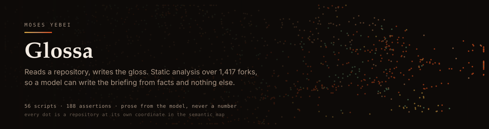

<p align="center">
  <a href="https://github.com/moses-y/moses-y.github.io/actions/workflows/update-forks.yml"></a>
  
  
  
  
  <a href="https://moses-y.github.io/llms.txt"></a>
</p>

> Every number in this README is read live from the pipeline's own output. If one
> of them is embarrassing, it is embarrassing on the front page.

**Glossa** — it reads a repository and writes the gloss.
A *gloss* is commentary bound to a source text; that is what a briefing here is.
Live at **[moses-y.github.io](https://moses-y.github.io)**.

---

## Why this exists

The best-documented curriculum in software architecture is already written. It is
the source of every serious open-source system: the decisions, the trade-offs, the
places where a design started costing its authors something. It is just completely
unreadable at the rate any one person reads.

So I fork what looks interesting — across AI, web, systems and mobile — and I built
Glossa to read it for me. What I am after is not the code but the judgement in it:
how real systems get designed, shipped and kept alive.

That is why the estate is mostly open source work, and why it has to be measured
rather than described. When the code is not yours, a claim about it is only worth
publishing if it traces back to a check that actually ran.

## What it does

Eight stages. Each writes a file the next one reads, so any number on the site can
be walked back to the check that produced it.

| # | Stage | What it does | Emits |
|---|-------|--------------|-------|
| 01 | **Census** | Enumerates every repository and its facts — language, size, licence, lockfile, last push | `forks.json` |
| 02 | **Briefing** | A model writes the article from the extracted facts alone — the prompt forbids naming an edge, path or effect that is not in them | `blog/<slug>.html` |
| 03 | **Structure** | Walks the file tree and parses sources into a module graph: imports, edges, cycles, depth | `structure/<id>.deep.json` |
| 04 | **Supply** | Resolves dependency manifests, then matches them against the OSV advisory database | `data/deps.json`, `data/osv.json` |
| 05 | **Hygiene** | 62 checks across CI, tests, secrets, runtime and supply chain, each a finding with a severity and a count | `data/hygiene.json` |
| 06 | **Grade** | Charges those findings to 8 weighted axes. Deterministic — the same inputs grade identically | `data/grades.json` |
| 07 | **Meaning** | Embeds each repository, draws semantic and dependency-derived edges, clusters by modularity | `data/relations.json`, `data/clusters.json` |
| 08 | **Publish** | Emits a declared schema and an `llms.txt` traversal protocol | `data/schema.json`, `llms.txt` |

A model writes prose, never a number. Every figure in a briefing comes from a check
that ran; embeddings inform the *map*, never the grade. That separation is the whole
design — it is what makes a generated article about someone else's repository worth
publishing at all.

Symbols come from [tree-sitter](https://tree-sitter.github.io/) across Python,
TypeScript, JavaScript, Go and Rust; the semantic layer from
`nvidia/nv-embedqa-e5-v5`; clustering is Louvain modularity over thresholded edges,
run deterministically because the output is committed.

## What it refuses to do

These are properties of the code, not of the estate — they hold whether one
repository is unaudited or four hundred are.

- **"Not analysed" never renders as "clean."** A repository graded without
  module-level analysis is marked `partial` and drawn desaturated. A neutral score
  on an axis nothing measured is a false claim, not a safe default.
- **Unaudited is not a grade.** It gets a colour outside the scale entirely, not the
  bad end of it. An F awarded because nothing has looked yet would be a lie about
  someone's repository.
- **Provenance is stated per fact, not per page.** A dependency edge names its
  packages and can be checked (`EXTRACTED`); a similarity edge is a cosine score
  from a model and says so (`INFERRED`). Claiming one standard for a whole site is
  how a page ends up asserting more than it measured.
- **Coverage is reported against the denominator that makes it true.** Stack-edge
  coverage is 349 of the 396 repositories with resolvable manifests — not of 1,439.

## The published data layer

The output is meant to be read by agents as well as people, so it is shaped for
traversal rather than for bulk download.

| File | For |
|------|-----|
| [`llms.txt`](https://moses-y.github.io/llms.txt) | Entry point and a four-step protocol for answering a question from these files |
| [`data/schema.json`](https://moses-y.github.io/data/schema.json) | Every record key, declared and drift-tested in both directions |
| [`data/kin/<id>.json`](https://moses-y.github.io/data/kin/1349268407.json) | One repository's neighbours, pre-materialised — ~1.2 KB instead of a 796 KB index parse |
| [`data/grade-map.json`](https://moses-y.github.io/data/grade-map.json) | `id → [score, letter, partial]`, 37 KB against `grades.json`'s 2.9 MB |
| [`stats.json`](https://moses-y.github.io/stats.json) | The pipeline's own figures, counted rather than typed |

`.claude/skills/query-repo-estate/` ships a dependency-free CLI over the same files:

```bash
node .claude/skills/query-repo-estate/estate.mjs find "vector database"
node .claude/skills/query-repo-estate/estate.mjs kin 1349268407
node .claude/skills/query-repo-estate/estate.mjs report
```

## Running it

**Node 22 or newer** — the state store uses `node:sqlite`, which is built in from 22.
CI runs 24. Clone, install, then run whichever stage you want: each is independent and
reads only what earlier stages wrote.

```bash
npm install

node scripts/build-structure.js --limit 150            # file trees for new repos
node scripts/build-analyze.js --all --budget 40        # module graphs, budgeted
node scripts/build-hygiene.js --budget 80              # the 62 checks
node scripts/build-osv.js --budget 80                  # advisories
node scripts/build-grade.js                            # pure join, no network
node scripts/build-index.js
node scripts/build-relations.js                        # embeddings, clusters, llms.txt
node scripts/build-stats.js
node scripts/build-banner.js                           # this README's banner

node scripts/build-store.js --verify                   # relational store, from the JSON above
```

Every network stage is budgeted, so a run costs a bounded number of requests and a
backlog drains across successive passes rather than in one 6-hour job. GitHub Actions
runs the whole thing every two hours.

The embedding stage reads `NVIDIA_API_KEY` (or `LLM_API_KEY`) from the environment.
**This repository is public and served by GitHub Pages — keys belong in the
repository's Actions secrets, never in a file here.** A pre-commit hook blocks the
common key formats from being staged at all.

The site's `index.html`, `assets/css/site.css` and `assets/js/site.js` are **built
files**. Edit the partials in `assets/partials/index/`, `assets/css/site/` and
`assets/js/site/`, then run `node scripts/build-bundles.js` — a hook refuses a commit
where a partial changed and its bundle did not.

## The state store

```bash
node scripts/build-store.js --verify   # core + reference data, then check the counts
node scripts/build-store.js --deep     # also per-repo modules and symbols
```

`.state/glossa.db` is a SQLite database built from the published JSON. It is **not
committed** — a binary rewritten every two hours is exactly the mistake the old
`forks.db` made — and nothing reads it yet. It exists first as a check: loading six
denormalised files into one schema with enforced foreign keys is the only thing that
has ever verified they agree with each other.

It also makes three relationships real that were nested objects pretending otherwise:

| Was | Is | Why it mattered |
|---|---|---|
| `PROFILES` `{profile: {axis: weight}}` | `profile_weight` | the weights a repo was graded under were copied onto all 1,440 grade records |
| `PENALTIES` `{check: [axis, cost]}` | `grade_charge` | a two-element array for a relationship, so a check charged to no axis was invisible |
| `osv.json` nested packages | `advisory_affects` | "which repos does this advisory reach" needed a full scan and a manual join |

Migrations are numbered, forward-only SQL under `migrations/`, applied in order at
open. They replace four independent version constants — `DEPS_VERSION`,
`SYMBOLS_VERSION`, `CHECKS_VERSION`, `ARTICLE_VERSION` — each stored under a different
key and compared a different way. Per-row staleness stays a column, because it drives
recompute rather than schema shape; conflating the two is what produced four systems
instead of one.

Migration 002 also restores full-text search over article prose. The old `forks.db`
indexed summaries with FTS4; `data/search.json` never has, so the 7.3 MB of
model-written text — the most expensive data here — had been searchable by nothing.

## Tests

```bash
for t in scripts/test-*.js; do node "$t"; done
```

206 assertions across 12 hermetic suites — no network, no `forks.json`, fixtures
only. They exist to catch the failures that would make a published claim false
rather than merely wrong: a weight set that stops summing to 100 after a profile
edit, a check that ships and is never charged to an axis, a grade that moves when
the same inputs are graded twice, a slim colour map that silently disagrees with the
grades it was derived from, or a figure on the home page that nothing writes.

## Layout

```
scripts/          58 build scripts + 12 test suites
  lib-*.js        the pure parts: grading, relations, clustering, schema
  lib-net.js      bounded concurrency + retry for the network stages
  lib-db.js       the state store and the one migration runner
  lib-json.js     stable serialisation: sorted keys, skip-if-unchanged
  checks-*.js     the 62 hygiene checks, one file per family
  build-*.js      the stages, in the order above
migrations/       numbered, forward-only SQL
.state/           glossa.db — build state, not committed, not served
data/             published output — the data layer
structure/        per-repository module graphs
assets/
  partials/index/ the home page's sources (index.html is generated)
  css/site/       stylesheet partials (site.css is generated)
  js/site/        script partials (site.js is generated)
.githooks/        pre-commit: secret scan, 450-line file cap, bundle freshness
.claude/skills/   the estate CLI and the browser driver
```

## Licence

[CC BY 3.0](LICENSE.txt) for the site content. The forked repositories under
analysis remain under their own licences; nothing here redistributes their source.
