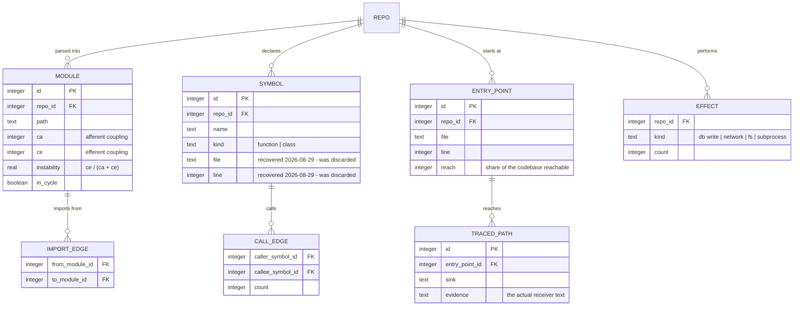
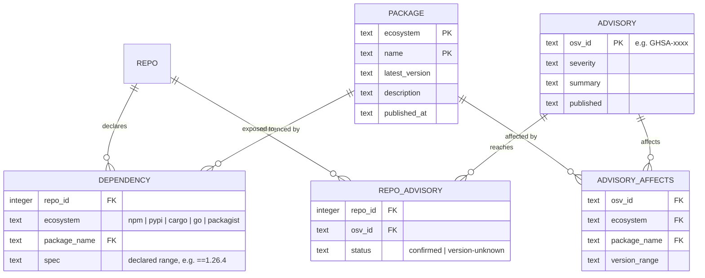
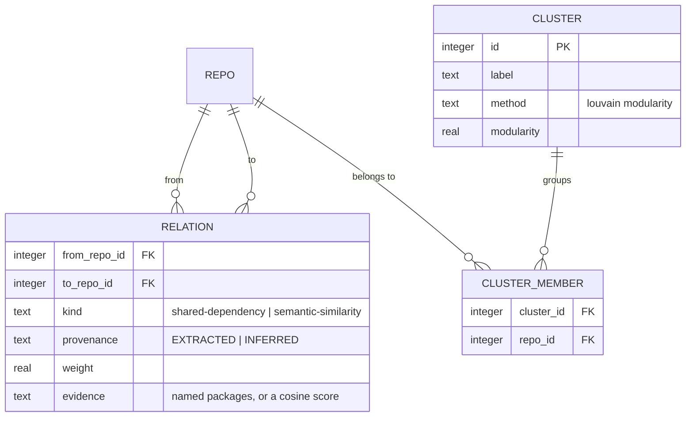
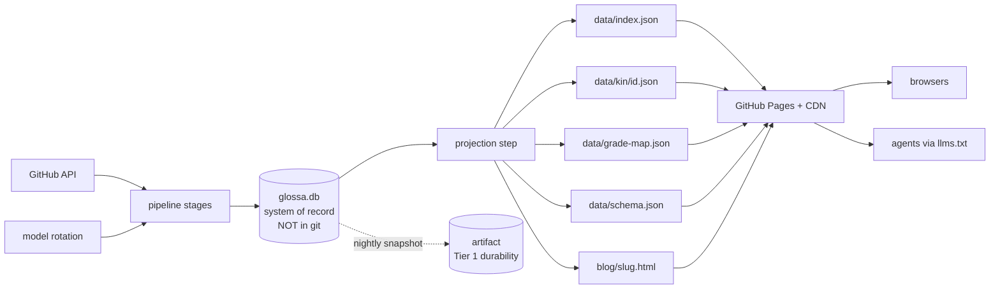

# Data model

The relational model behind Glossa: SQLite as the system of record, static JSON
as the published projection. Derived from what the pipeline already produces -
every table below maps to data on disk today.

Serving does not change. Pages and agents keep fetching `data/*.json` shards
over a CDN; those files become a *projection* of this schema rather than the
schema itself.

## Tiering by reproducibility cost

The thing that decides durability policy is not "is it data" but "what does it
cost to rebuild".

| Tier | Contents | Size | Rebuild cost |
|---|---|---|---|
| **1** | `article.summary`, `embedding.vector` | 7.3 MB | ~1,331 model calls, ~12 days of cron, real API spend |
| **2** | modules, symbols, findings, grades, deps | 28.1 MB | free, bounded, recomputable from GitHub |
| **3** | index, kin, clusters, search | small | seconds |

**Tier 1 must never live in evictable storage.** An Actions cache eviction
would cost the only asset that takes real money and two weeks to rebuild, while
the 28 MB beside it rebuilds for nothing.

---

## 1. Core and Tier 1

```mermaid
erDiagram
    REPO ||--o| ARTICLE : "has one"
    REPO ||--o| EMBEDDING : "has one"
    REPO ||--o| KNOWLEDGE_GRAPH : "has one"
    REPO ||--o{ SUBPROJECT : "contains"
    REPO |o--o| REPO : "forked from"

    REPO {
        integer id PK "GitHub numeric id - the join key everywhere"
        text name
        text display_name
        text description
        text url
        text language "null for 82 of 1440"
        integer stars
        integer forks
        text type "original | fork"
        text forked_at
        text updated_at
        integer parent_id FK "null for 22 originals"
    }
    ARTICLE {
        integer repo_id PK_FK
        text summary "TIER 1 - model written, 7.3 MB total"
        integer article_version "was forks.json av"
        text model "which model in the rotation wrote it"
        text generated_at
        integer read_time
    }
    EMBEDDING {
        integer repo_id PK_FK
        blob vector "TIER 1 - 1024 dims"
        text model
        integer dims
    }
    KNOWLEDGE_GRAPH {
        integer repo_id PK_FK
        integer total_files
        boolean has_docker
        boolean has_ci
        text ci_platform
        text package_manager
        integer test_file_count
        integer doc_count
        boolean is_collection "a shelf of projects, not one codebase"
    }
    SUBPROJECT {
        integer id PK
        integer repo_id FK
        text path
        integer files
        integer notebooks
    }
```

Note `REPO.parent_id` as a real self-referencing FK. Today parent is three
denormalised columns (`parent_name`, `parent_url`, `parent_stars`) copied onto
every fork - the upstream is often itself in the estate.

## 2. Static analysis



`SYMBOL.file` and `SYMBOL.line` are why a claim can be cited. They were stored
on disk and thrown away in the fact bundle until 3ffe5ac1.

## 3. Grading

The part most distorted by JSON. Weights vary by *profile* - a notebook repo is
not graded like a service - and findings are *charged* to axes with a cost.
That is two join tables pretending to be nested arrays.

```mermaid
erDiagram
    CHECK ||--o{ FINDING : "raises"
    REPO ||--o{ FINDING : "has"
    REPO ||--|| GRADE : "receives"
    GRADE ||--o{ GRADE_AXIS : "breaks down into"
    AXIS ||--o{ GRADE_AXIS : "scored on"
    PROFILE ||--o{ PROFILE_WEIGHT : "weights"
    AXIS ||--o{ PROFILE_WEIGHT : "weighted by"
    FINDING ||--o{ GRADE_CHARGE : "charged as"
    GRADE_AXIS ||--o{ GRADE_CHARGE : "accumulates"

    CHECK {
        text id PK "62 of them, e.g. no-license"
        text family "ci | secrets | supply | quality | runtime | osv"
        text default_severity
        integer checks_version
    }
    FINDING {
        integer id PK
        integer repo_id FK
        text check_id FK
        text severity
        text category
        text title
        text where
        text evidence
        text why
        text fix
        real rank "severity x confidence x reach"
        integer n "occurrences"
    }
    AXIS {
        text key PK "8 of them, e.g. cleanliness"
        text label
    }
    PROFILE {
        text name PK "notebook | service | library | ..."
    }
    PROFILE_WEIGHT {
        text profile FK
        text axis_key FK
        real weight "must sum to 100 - a test asserts this"
    }
    GRADE {
        integer repo_id PK_FK
        real score
        text letter
        text next_letter
        real next_points
        text profile FK
        text audited_at
        boolean partial "not analysed is NOT clean"
    }
    GRADE_AXIS {
        integer repo_id FK
        text axis_key FK
        real weight
        real score
        text evidence
        boolean partial
    }
    GRADE_CHARGE {
        integer repo_id FK
        text axis_key FK
        text check_id FK
        real cost
    }
```

`GRADE.partial` is load-bearing and must survive any migration. A repo graded
without module-level analysis is marked partial and drawn desaturated, because
a neutral score on an axis nothing measured is a false claim, not a safe
default.

## 4. Supply chain



`REPO_ADVISORY.status` preserves a distinction the current rollup already makes
and that must not be flattened: a repo pinned to an affected version is a
different claim from one whose version could not be resolved.

## 5. Relations and clusters



`RELATION.provenance` is the project's best idea and currently applies to two
edge types and nothing else. As a column it becomes queryable, and every
consumer can be made to state it.

## 6. State to published



## Migrations

Replaces four independent version constants, each stored under a different key
and compared by hand:

    build-deps.js:46           DEPS_VERSION = 2       versions[id] >= X
    build-symbols.js:45        SYMBOLS_VERSION = 3    (j.v || 1) !== X
    lib-hygiene.js:31          CHECKS_VERSION = 3     (prev.v || 1) !== X
    lib-article-version.js:35  ARTICLE_VERSION = 2    (existing.av || 1) >= X

These are a migration system, invented four times. Consolidate to:

```sql
CREATE TABLE schema_migrations (
  version     INTEGER PRIMARY KEY,
  name        TEXT NOT NULL,
  applied_at  TEXT NOT NULL
);
```

Numbered, forward-only SQL files under `migrations/NNN-name.sql`, applied in
order at pipeline start. Per-row staleness stays as a column
(`finding.checks_version`, `article.article_version`) because it drives
*recompute*, not schema shape - the two were conflated before.

## What does not change

- Published JSON keeps identical paths and shapes. `data/schema.json` is still
  emitted and still drift-tested in both directions.
- The five advertised public URLs stay stable: `llms.txt`, `data/schema.json`,
  `data/kin/<id>.json`, `data/grade-map.json`, `stats.json`.
- Serving stays static on a CDN. No server on the read path, which is the
  cheapest and most available option and would be a downgrade to replace.
- SQLite is a file: it runs unchanged on an Actions runner, a VPS, or bare
  metal. That is the whole hedge, and it costs nothing to hold.
