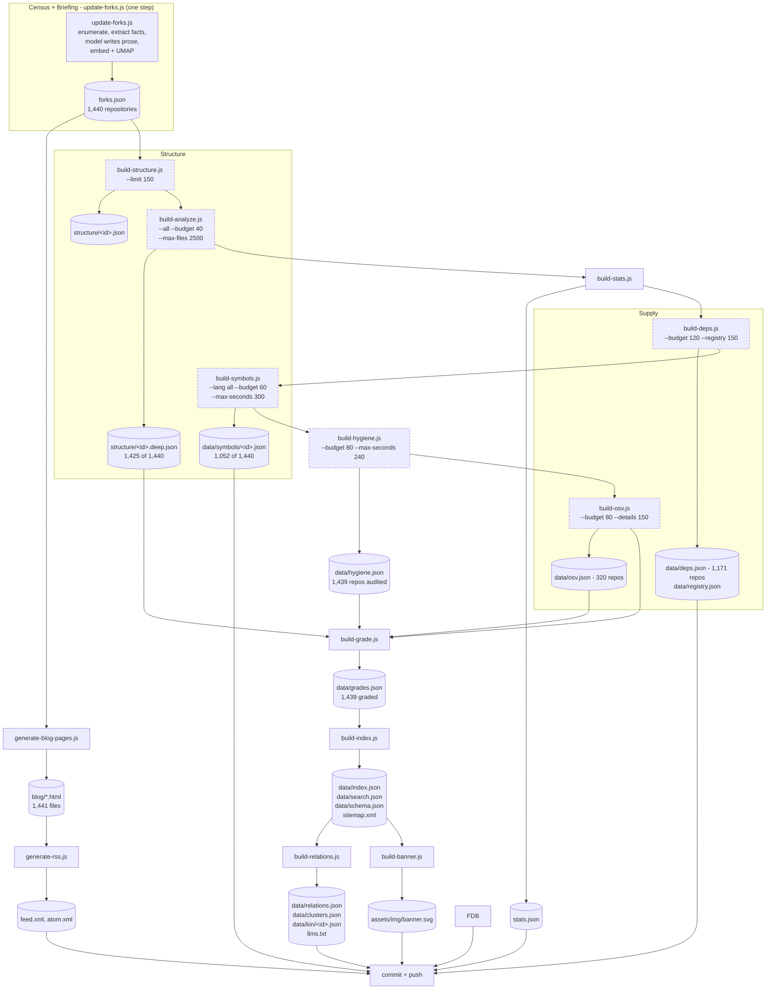

# Glossa: the end-to-end pipeline

**Status:** DERIVED - every figure read from the files listed below.

**Sources:** `.github/workflows/update-forks.yml`, `scripts/update-forks.js`, `scripts/build-structure.js`, `scripts/build-analyze.js`, `scripts/build-stats.js`, `scripts/build-deps.js`, `scripts/build-symbols.js`, `scripts/build-hygiene.js`, `scripts/build-osv.js`, `scripts/build-grade.js`, `scripts/build-index.js`, `scripts/build-relations.js`, `scripts/build-banner.js`, `scripts/generate-blog-pages.js`, `scripts/generate-rss.js`, `README.md`, `index.html`, `forks.json`, `stats.json`, `data/relations.json`, `data/grades.json`, `data/hygiene.json`, `data/osv.json`, `data/deps.json`, `data/symbols-status.json`

Glossa reads GitHub repositories, extracts facts about them, and has a model write
an article from those facts alone. The discipline the whole thing exists to hold is
that a published claim traces back to a check that ran, so this page is arranged
around the artefact each stage emits: given a number on the site, the file it came
from names the script that wrote it.

## The named stages

The site (`README.md`, and the `pipeline-stages` list in `index.html`) states eight
stages: Census, Briefing, Structure, Supply, Hygiene, Grade, Meaning, Publish. That
is the conceptual order, and it is not quite the execution order. Two differences,
both real, both worth knowing before tracing a number:

- **Census and Briefing are one process.** `scripts/update-forks.js` runs first and
  alone in its workflow step; it enumerates the estate *and* writes the article, both
  into `forks.json`. There is no separate briefing script. `generate-blog-pages.js`
  runs later and renders the already-written prose into `blog/<slug>.html`.
- **Meaning is split across the two ends of the run.** The embedding and the UMAP
  projection happen inside `update-forks.js` (it requires `generateEmbeddings` and
  `computeUmapAndKnn` from `lib-embeddings.js` and writes `fork.umap`). The relation
  layer built on top of them - `data/relations.json`, `data/clusters.json`,
  `data/kin/<id>.json` - is written by `build-relations.js`, which runs *last*,
  after `build-index.js`. So the Publish artefact `data/schema.json` (written by
  `build-index.js`) exists before the Meaning artefacts do, and `llms.txt`, also a
  Publish artefact, is written by `build-relations.js`. Stages 07 and 08 interleave.

Everything else runs in the stated order.

## Execution order, as the workflow runs it

The dashed boxes are the eventually-consistent part, and it is the property that
shapes most of the diagram: one run does a slice, and the backlog drains over
successive cron passes. The workflow runs on `cron: '0 */2 * * *'` - every two
hours - and six of the build steps take a per-run budget rather than sweeping the
whole estate. `build-analyze.js` takes 40 repositories a run, `build-deps.js` 120
repositories and 150 package resolutions, `build-symbols.js` 60 repositories or 300
seconds of wall clock, whichever binds first, `build-hygiene.js` 80 repositories or
240 seconds, `build-osv.js` 80 repositories and 150 advisory-detail fetches, and
`build-structure.js` 150 repositories. Each of those scripts skips what it has
already done, so a pass costs a bounded number of requests and the arrears drain
over successive runs instead of one run either finishing or timing out.

The consequence a reader has to hold onto: **the artefacts are not all the same age
and are not all complete.** At the time of reading, `structure/` holds 1,425 deep
graphs against 1,440 repositories, `data/symbols-status.json` records 1,052,
`data/deps.json` covers 1,171 and `data/osv.json` 320. A repository absent from one
of those files has not been judged and found wanting; it has not been reached yet.
`build-grade.js` is explicit about this - a repository with no hygiene audit is
skipped rather than graded from defaults, because "an F awarded because nothing has
looked at the repository yet is a false claim".

## Why the order is what it is

Three constraints fix nearly all of it.

**Cheap joins go last.** `build-grade.js` does no network and runs no model; it is a
join over `forks.json`, `data/hygiene.json`, `structure/<id>.deep.json` and
`data/osv.json`, which is exactly why it must run after all three of its inputs and
why it can afford to run on every pass. The same holds for `build-relations.js`,
which reads the index `build-index.js` has just written, and for `build-banner.js`,
which draws from `data/index.json` so that the banner shows this run's estate rather
than the last one's.

**The read side is separate from the write side.** `forks.json` is the write-side
artefact and it is large - the header of `build-index.js` records it at 10.3MB, 44%
article prose and 26% file trees. Listings need none of that, so `build-index.js`
emits `data/index.json` and `data/search.json` for the browser and leaves the detail
where it was. Everything downstream of the index reads the small files.

**Failure must stay visible.** Each build command is followed by `|| note <name>`,
appending to `$RUNNER_TEMP/failed-steps.txt` so the remaining steps still run and the
backlog still drains, and a final step fails the run if that file is non-empty. The
workflow comment records why: the stage previously ended in `|| true`, a crash was
indistinguishable from a clean pass, and the audit flagged that against this
repository as a high finding.

## What the model does and does not touch

`update-forks.js` is the only step that calls a language model for prose, and it
writes prose only. The counts on the site come from `stats.json`
(`build-stats.js`); grades come from `data/grades.json`, a deterministic join. The
embedding model `nvidia/nv-embedqa-e5-v5` - named in `data/relations.json` and
defaulted in the workflow's `EMBED_MODEL` variable - informs the map only.
`data/relations.json` labels its two edge types by provenance for exactly this
reason: `stack` edges are EXTRACTED from dependency manifests committed to both
repositories, `semantic` edges are INFERRED, and clusters are built from the
semantic edges alone, so cluster membership is marked INFERRED too.

## Tracing a number

Start from the artefact, not the page.

| If the number is about | Read | Written by |
|---|---|---|
| a repository's own facts, or its article text | `forks.json` | `update-forks.js` |
| headline counts (repos, languages, files, modules, findings) | `stats.json` | `build-stats.js` |
| modules, edges, cycles, findings within one repository | `structure/<id>.deep.json` | `build-analyze.js` |
| named functions and classes | `data/symbols/<id>.json`, `data/symbols-index.json` | `build-symbols.js` |
| declared dependencies, or a package's latest version | `data/deps.json`, `data/registry.json` | `build-deps.js` |
| a named advisory | `data/osv.json` | `build-osv.js` |
| a code-health finding | `data/hygiene.json` | `build-hygiene.js` |
| a letter grade | `data/grades.json`, `data/grade-map.json` | `build-grade.js` |
| a cluster, a neighbour, a threshold | `data/relations.json`, `data/clusters.json`, `data/kin/<id>.json` | `build-relations.js` |
| what a field in the index means | `data/schema.json` | `build-index.js` |

Current thresholds, read from `data/relations.json`: cluster at 0.68 semantic
similarity, stack edges at a minimum of 0.12, packages above 0.25 document frequency
excluded as furniture, 12 neighbours kept per repository. Those yield 3,444 semantic
edges, 61 clusters covering 167 repositories, 1,425 neighbourhood files, and 350
repositories carrying at least one stack edge.

Two figures the site quotes come from the `pipeline` block of `stats.json` rather
than being recomputed here: 62 checks across 8 axes, over 56 scripts, 11 suites and
188 assertions. Whether each of those still counts what its name says is unverified
from the files read for this page.
