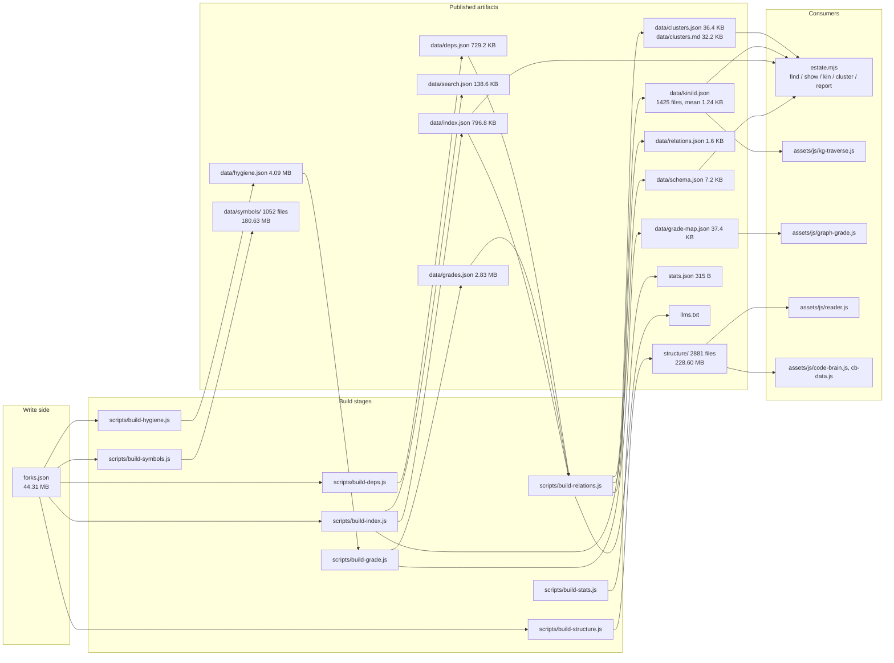
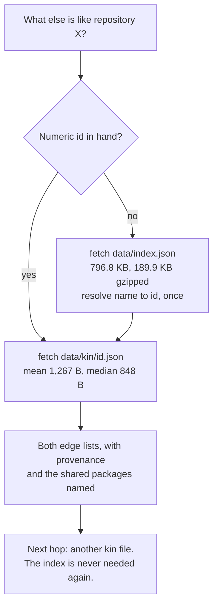

**Status:** DERIVED - every figure measured from the files listed below.
**Sources:** `data/` (all files, plus `data/kin/` and `data/symbols/`), `data/schema.json`, `data/relations.json`, `llms.txt`, `stats.json`, `forks.json` (size only), `structure/`, `scripts/build-index.js`, `scripts/build-relations.js`, `scripts/lib-schema.js`, `.claude/skills/query-repo-estate/estate.mjs`, `assets/js/kg-traverse.js`, `assets/js/graph-grade.js`.

# The published data layer

Glossa publishes its output as static files on GitHub Pages. There is no server,
no query endpoint and no key, so the only design lever available is the shape of
the files: what gets split out, what gets pre-computed, and what a question costs
in bytes. The argument the layer makes is that a caller answering a question
about one repository should pay about a kilobyte, not the 796.8 KB of
`data/index.json`. `llms.txt` publishes that traversal protocol explicitly, and
both browser consumers and the command-line consumer follow it rather than
reimplementing it.

## Producers, artifacts, consumers

`scripts/lib-schema.js` is not a build stage. It holds the key and description
table for the single-letter record keys, plus the companion-file list, and
`build-index.js` writes its `describe()` output straight out as
`data/schema.json`. The schema is emitted from the same module the builder uses,
so the two cannot drift.

## What each artifact costs

Sizes measured with `stat -c %s`; gzip figures from `gzip -c | wc -c`, which is
closer to what a caller over HTTPS actually pays.

| Artifact | Bytes | KB | Gzipped | Written by |
| --- | ---: | ---: | ---: | --- |
| `data/index.json` | 815,923 | 796.8 | 189.9 KB | `build-index.js` |
| `data/schema.json` | 7,401 | 7.2 | 2.5 KB | `build-index.js` via `lib-schema.js` |
| `data/search.json` | 141,974 | 138.6 | 53.8 KB | `build-index.js` |
| `data/relations.json` | 1,689 | 1.6 | 0.8 KB | `build-relations.js` |
| `data/clusters.json` | 37,247 | 36.4 | 6.3 KB | `build-relations.js` |
| `data/clusters.md` | 32,939 | 32.2 | - | `build-relations.js` |
| `data/kin/` (1,425 files) | 1,805,315 | 1,762.9 | - | `build-relations.js` |
| `data/grade-map.json` | 38,320 | 37.4 | 11.2 KB | `build-grade.js` |
| `data/grades.json` | 2,967,706 | 2,898.2 | - | `build-grade.js` |
| `data/hygiene.json` | 4,288,177 | 4,187.7 | - | `build-hygiene.js` |
| `data/deps.json` | 746,717 | 729.2 | - | `build-deps.js` |
| `data/osv.json` | 3,930,121 | 3,837.9 | - | `build-osv.js` |
| `data/registry.json` | 583,563 | 569.9 | - | `build-deps.js` |
| `data/symbols-index.json` | 102,037,423 | 99,646.9 | - | `build-symbols.js` |
| `data/symbols-status.json` | 15,787 | 15.4 | - | `build-symbols.js` |
| `data/symbols/` (1,052 files) | 189,405,968 | 184,966.8 | - | `build-symbols.js` |
| `structure/` (2,881 files) | 239,716,976 | 234,090.8 | - | `build-structure.js`, `build-deepgraph.js` |
| `stats.json` | 315 | 0.3 | - | `build-stats.js` |
| `forks.json` | 46,461,754 | 45,372.8 | - | write side, before `build-index.js` |

Per-file distributions, since a directory total is the wrong number for a caller
who fetches exactly one file:

| Directory | Files | Mean | Median | Min | Max |
| --- | ---: | ---: | ---: | ---: | ---: |
| `data/kin/` | 1,425 | 1,267 B | 848 B | 408 B | 5,661 B |
| `data/symbols/` | 1,052 | 180,044 B | 77,401 B | 127 B | 846,036 B |

`structure/` holds 1,441 shallow files - 1,440 per-repository trees plus
`structure/reports.json` at 216,799 B - and 1,440 `<id>.deep.json` import-graph
files alongside them.

## Why the shape is what it is

**Splitting the write side from the read side.** `forks.json` is 45,372.8 KB and
carries article prose and full file trees. `build-index.js` reduces it to
`data/index.json`, `data/search.json` and `sitemap.xml`. The record keys in the
index are single letters - `i`, `n`, `t`, `d`, `l`, `g`, `k`, `s`, `y`, `f`, `x`,
`a`, `c`, `v`, `m`, `r`, `z`, `p`, `u` - because at 1,440 records the key names
were a measurable share of the file. That trade only holds if the key itself is
published, which is what `data/schema.json` is for.

**`grade-map.json` exists because `grades.json` is too big to ask for one
colour.** Verified: `grades.json` is 2,967,706 B (2.83 MB), and every record
carries the letter, the eight weighted categories, an evidence string per
category and the individual findings charged against each. `grade-map.json` is
38,320 B (37.4 KB, 11.2 KB gzipped) and each record is `id -> [score, letter,
partial]`. `assets/js/graph-grade.js` fetches `data/grade-map.json` and nothing
else: it needs one band colour per node across the whole graph, so it would
otherwise pay 2.83 MB to read three values per repository. That is a 77-fold
reduction for the one consumer that wants the number without the reasoning. The
claim in `lib-schema.js` - "About 37 KB against 2.9 MB" - checks out.

**Kin files are pre-materialised conclusions, not raw edges.** Verified: a kin
file is not a list of edge tuples that the caller must join against something
else. Each one carries the subject repository's own domain, language, grade
letter and score, its article path, its cluster, a `provenance` object, and then
two ranked lists - `semantic` neighbours with a similarity, and `stack`
neighbours with an IDF weight and the actual shared package names spelled out.
All the joining against `index.json`, `grades.json` and `deps.json` happened in
`build-relations.js` at build time. The mean file is 1,267 B and the median
848 B, so the "about 1 KB" figure in `llms.txt` and in `kg-traverse.js` holds on
both measures. Against 796.8 KB for the index, one hop costs roughly a tenth of
one per cent of a full index parse.

**Provenance travels with the data.** `data/relations.json` (1.6 KB) declares
both edge types, their thresholds and their counts: `stack` is EXTRACTED from
dependency manifests by IDF-weighted cosine, packages above 0.25 document
frequency excluded as furniture; `semantic` is INFERRED from
`nvidia/nv-embedqa-e5-v5` embeddings with no evidence beyond the score. Each kin
file repeats that as its own `provenance` object, so a caller that fetched only
one 1 KB file still knows which half of it can be checked. The `v` key in the
index carries the same discipline in miniature: `0` means audited and clean, an
array means findings by severity, and absence means not audited - three states
the schema explicitly forbids collapsing into two.

**Two answers to the same question, at different prices.** `clusters.json`
(36.4 KB) is the records; `clusters.md` (32.2 KB) is the same 61 groups written
as prose. `estate.mjs report` prints the second. Neither is generated on demand.

## Cost of a real question

`estate.mjs` implements exactly this and says so in a comment on `resolve()`: a
numeric argument costs one small fetch, a name costs the whole index. Its `kin`
command, given an id, touches only `data/kin/<id>.json`; `show` is the expensive
command, because it needs the full record and the schema to label it.
`assets/js/kg-traverse.js` does the same in the browser, caching one fetch per
repository including the misses - a node can exist in the graph before it has a
neighbourhood, since the graph is built from `forks.json` and the relation layer
from a later stage. Neither consumer keeps a private copy of the key mapping:
`estate.mjs` decodes the single letters from `/data/schema.json` at runtime,
deliberately, so that if the published schema stops being sufficient to read the
published index, something visibly breaks.

## Discrepancies found

These are stale figures in source comments, not in emitted data. Recorded rather
than silently corrected, since none of them was in scope to change here.

- `scripts/build-index.js` header calls `forks.json` "10.3MB". Measured: 46,461,754 B (44.31 MB).
- `scripts/lib-schema.js` and `estate.mjs` both describe the index as "774 KB". Measured: 796.8 KB. `llms.txt`, which is regenerated each build from a live `statSync`, says 797 KB and is current.
- `assets/js/graph-grade.js` says "1,432 of 1,433 repositories". The current counts are 1,439 graded of 1,440, per `data/grade-map.json` and `data/relations.json`. The same comment's "396 repositories graded without module-level analysis" was not checked and is unverified here.

Two things are surprising rather than wrong. First, the bulk of the published
bytes is not the index layer at all: `data/symbols/`, `data/symbols-index.json`
and `structure/` together come to roughly 508 MB, against about 15.7 MB for
everything else in `data/`. The kilobyte-per-question design governs the
traversal layer; the deep analysis artifacts are large and are fetched only when
a specific page opens one. Second, `data/symbols-index.json` (99,646.9 KB) is a
single file that appears to hold what the 1,052 per-repository files in
`data/symbols/` already carry. No consumer among the files read here fetches it;
whether one elsewhere in the site does is unverified.

## The relational store

**Status:** BUILT, NOT YET AUTHORITATIVE.

`.state/glossa.db` (`scripts/lib-db.js`, `scripts/build-store.js`) is a SQLite
database loaded from the JSON described above. Node 22+ ships `node:sqlite`, so it
costs no dependency; CI runs 24.

The direction of travel is that the database becomes the system of record and these
JSON files become a projection of it. Serving does not change: static files on a CDN
are the cheapest and most available read path available, and replacing them with an
origin would be a downgrade. The database sits behind the build, never in front of a
reader.

Three relationships in the JSON were many-to-many stored as nested objects, which is
why the same fact ended up in six files with nothing able to verify they agreed:

| JSON shape | Table | What it could not answer before |
|---|---|---|
| `PROFILES` `{profile: {axis: weight}}` | `profile_weight` | what weights was THIS repo graded under, without re-deriving them |
| `PENALTIES` `{check: [axis, cost]}` | `grade_charge` | which checks cost the estate the most |
| `osv.json` nested packages | `advisory_affects` | which repositories does this advisory reach |

The first load found two modelling errors that JSON could not have surfaced.
`grades.json` `audited` is a boolean meaning *whether*; `hygiene.json` `audited` is
an ISO string meaning *when* - the same field name for two different things in two
files. And materialising profile weights from the raw overrides gave sums of 90 to
106, because `weightsFor()` renormalises to 100 and modelling it a second time
reproduced exactly the drift the table exists to prevent.

Tiering, which decides durability policy, is by rebuild cost rather than by kind:

| Tier | Contents | Size | Rebuild |
|---|---|---|---|
| 1 | article prose, embeddings | 7.3 MB | ~1,331 model calls, ~12 days of cron |
| 2 | modules, symbols, findings, grades, deps | 28.1 MB | free, from GitHub |
| 3 | index, kin, clusters, search | ~1 MB | seconds |

**Tier 1 must never live in evictable storage.** An eviction would cost the only
asset that takes real money and two weeks to rebuild, while the 28 MB beside it
rebuilds for nothing.

See `docs/DATA-MODEL.md` for the full schema and entity diagrams.
