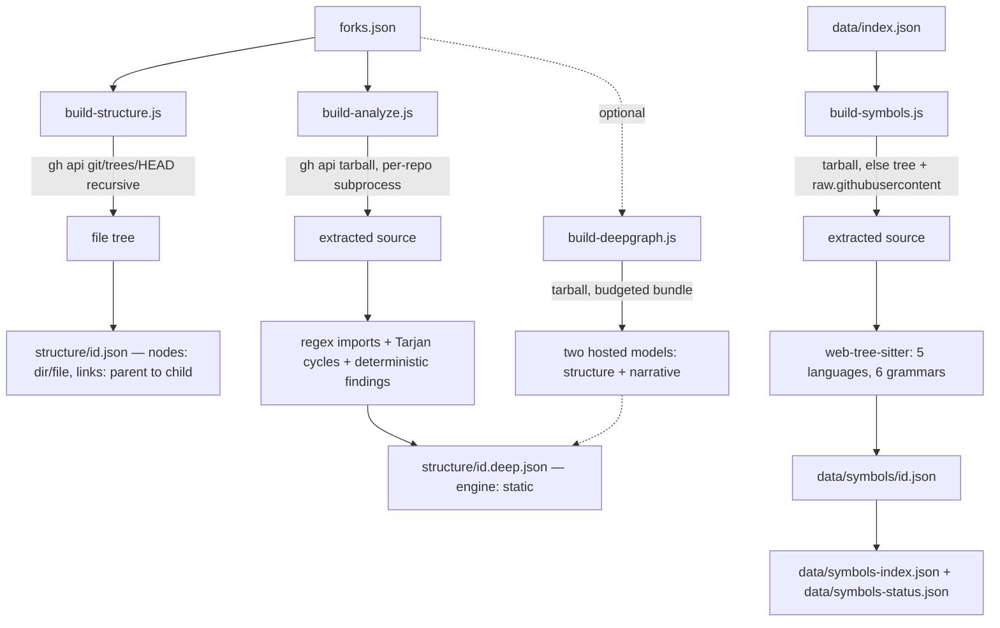

# Glossa: the parsing and static-analysis layer

**Status:** DERIVED - every figure read from the files listed below.
**Sources:** `scripts/build-structure.js`, `scripts/build-analyze.js`, `scripts/build-deepgraph.js`, `scripts/build-symbols.js`, `scripts/lib-languages.js`, `scripts/lib-effects.js`, `scripts/lib-knowledge-graph.js`, `scripts/test-languages.js`, `scripts/test-imports.js`, `package.json`, `structure/1004131322.json`, `structure/1004131322.deep.json`, `data/symbols/`, `data/symbols-index.json`, `data/symbols-status.json`.

Glossa turns a remote GitHub repository into three progressively deeper artefacts: a file tree, a module graph, and a symbol table. Each is produced by a separate pass, each pass is resumable, and each carries an explicit budget so that a single run has a bounded cost and the backlog drains over successive runs.

## The pipeline

## Pass 1: the file tree

`scripts/build-structure.js` makes one GitHub API call per repository - `repos/<owner>/<repo>/git/trees/HEAD?recursive=1`, through `gh api --cache 24h` - and never clones. Blobs whose path matches `SKIP_DIR` (`node_modules`, `.git`, `dist`, `build`, `out`, `vendor`, `.venv`, `venv`, `__pycache__`, `.next`, `target`, `.cache`, `coverage`, `.idea`, `.vscode`) are dropped. The rest are sorted source-code-first (the `CODE_EXT` set) and then by descending size, and the first `MAX_NODES = 1200` are kept.

The ordering is the whole point of the cap. Trimming by arbitrary order would cut architecture at random; trimming after a code-first sort means the files that are cut are the ones carrying the least structural signal. The comment in the file gives two reasons for the ceiling existing at all: browser render performance when a repository's tendrils sprout into the live 3D scene, and total payload across every repository on a static host.

Why this pass is separate from the module graph pass: it costs one cached API call and no download, so it can be run over the entire estate, and it gives every repository a real internal structure. The module graph requires a tarball, source reading and per-file analysis, and is therefore run over a selection. Progressive fidelity - a cheap universal layer plus an expensive selective one - is what keeps the whole estate covered.

Emitted shape, read from `structure/1004131322.json`: `{ id, name, truncated, totalFiles, nodes, links }`. Nodes are `{id, name, kind:'dir'}` or `{id, name, kind:'file', ext, lang, size}`; links are `{s, t}` with `__repo__` as the synthetic root. That file records `totalFiles: 88` and 105 nodes. A repository that cannot be fetched gets a stub with `empty: true` so it is not retried forever - 3 such stubs exist. There are 1441 plain structure files on disk.

## Pass 2: the module graph

Two implementations write `structure/<id>.deep.json`, and they are alternatives, not stages.

`scripts/build-analyze.js` is the deterministic one, and the one that produced the current data: of the 1440 `.deep.json` files on disk, 1272 carry `engine: "static"` and 168 are skip stubs. It downloads one tarball per repository (`timeout 120` on the fetch, `timeout 60` on extraction, a 200s Node timeout, and each repository runs in its own subprocess with a 90s wall-clock cap so no pathological repository stalls the batch). Imports are found by regex - Python `import` / `from … import`, and JavaScript/TypeScript `import`/`require`/`export … from` - then resolved against the file set (`resolvePy` handles dotted and relative forms plus `__init__`; `resolveJs` handles relative specifiers plus `/index`). Bare and external specifiers resolve to nothing and are dropped, so the graph is intra-repository only. Cycles come from Tarjan strongly-connected components of size greater than one.

Its budgets:

| Constant | Value | Purpose |
| --- | --- | --- |
| `MAX_NODES` | 1200 | modules kept in the emitted graph, ranked by `ca + ce` |
| `MAX_FILES` | 1500 | files analysed per repository (smallest first when trimming) |
| `MAX_DUP_FILES` | 800 | input to the O(files x lines) duplication pass |
| `BIG_SKIP` | 2500 | repositories with more code files than this skip deep analysis |
| `WALK_CAP` | 4000 | stop walking once this many code files are collected |
| per-file size | 400 KB | larger files are not walked at all |

`BIG_SKIP` is checked before the tarball is downloaded, using the cached trees API - a cheap pre-check that avoids pulling a giant archive only to discard it. Minified or generated files are detected by any line of 2500+ characters within the first 200 KB and skipped everywhere, because they cause pathological regex scans and carry no architectural signal. A skipped repository gets a stub with `deep: false` and a `skipped` reason, and the worker exits 4 rather than 3 so a handled outcome does not read in CI like a crash.

Findings are derived from measured facts only: oversized file (over 600 lines, high above 1200), deep nesting (depth 6, high at 8), branch density above 0.28 over files longer than 40 lines, import-cycle membership, hub modules (fan-in 12, high at 25), Python broad `except` and `open()` outside a context manager, JavaScript/TypeScript empty `catch` blocks, three or more TODO/FIXME/HACK/XXX markers, and cross-file duplication of normalised 6-line windows. Rank is severity weight times leverage times removability. Only the top 60 findings are emitted. The sample `structure/1004131322.deep.json` shows `scope: {discovered:32, analyzed:32, graphable:29, languages:{Python:12, JavaScript:3, TypeScript:14, Shell:3}}` and `totals: {modules:29, edges:11, cycles:0, findings:21, severity:{high:4, medium:17, low:0}}`.

`scripts/build-deepgraph.js` is the model-based alternative, writing the same filename. It bundles source into a prompt under `SRC_BUDGET = 120 KB` per repository with any single file truncated to `MAX_FILE = 24 KB`, smallest files first on the reasoning that many small files are the architecture signal. It calls two OpenAI-compatible endpoints on `https://integrate.api.nvidia.com/v1` (defaults `openai/gpt-oss-120b` for structure and `nvidia/nemotron-3-super-120b-a12b` for the narrative, both overridable by environment variable), asks for at most 300 modules and at most 15 findings, and filters returned links to node ids that actually exist. Its `SKIP_DIR` is stricter than pass 1's, additionally excluding `test`, `tests`, `__tests__`, `fixtures` and `examples`. No file in `structure/` currently carries its `model` field, so on this checkout the deterministic engine is what the site is built from.

## Pass 3: the symbol table

`scripts/build-symbols.js` is the tree-sitter pass. It reads `data/index.json` for candidates, fetches a tarball per repository, and parses with `web-tree-sitter` loading `.wasm` grammars. Five languages, six grammars, all declared in `package.json` and present in `node_modules`:

| Index language | Grammar (wasm) | Extensions | What the query extracts |
| --- | --- | --- | --- |
| Python (also Jupyter Notebook) | `tree-sitter-python` | `.py`, `.ipynb` | `function_definition`, `class_definition`, `import`/`import_from` dotted names, calls by identifier and by attribute |
| JavaScript | `tree-sitter-javascript` | `.js`, `.mjs`, `.cjs`, `.jsx` | function and generator declarations, methods, arrow and function-expression declarators, `class_declaration` (identifier), import source string, identifier and member-expression calls |
| TypeScript | `tree-sitter-typescript` | `.ts`, `.mts`, `.cts` | as JavaScript, with `class_declaration` (type_identifier) plus interface, type alias, enum and abstract class as `cls` |
| TypeScript (TSX) | `tree-sitter-tsx` | `.tsx` | the same query, a separate grammar |
| Go | `tree-sitter-go` | `.go` | `function_declaration`, `method_declaration`, `type_spec`, `import_spec` path, identifier and selector calls |
| Rust | `tree-sitter-rust` | `.rs` | `function_item`, `function_signature_item`, struct/enum/trait/type items, `use_declaration`, identifier, field and scoped calls |

Every query uses the same five capture names - `fn`, `cls`, `imp`, `call`, `mcall` - so extraction stays language-agnostic, plus a sixth, `mfull`, which captures the whole receiver expression. `mfull` exists because the internal call graph deliberately drops every edge whose target is not defined in the repository, and the external sinks are exactly what a reader wants: `requests.post`, `cursor.execute`, `subprocess.run`. `scripts/lib-effects.js` matches those full receiver expressions against six categories: `db`, `network`, `filesystem`, `subprocess`, `model`, `crypto`. Anything unmatched is left unclassified, because a wrong effect label would propagate into published prose as a claim about behaviour.

Method calls whose receiver type is unknown are filtered against an ambiguity list: a shared list in `build-symbols.js` (`read`, `get`, `logger`, `execute`, and so on) plus per-language additions in `lib-languages.js` - Go's interface conventions (`String`, `Error`, `Send`) and Rust's (`new`, `unwrap`, `clone`). The comments record what forced this: `self.logger()` ranked as the most-called "function" in one repository at 336 callers; Go's `Send` reached 71 callers in `term.everything`; Rust's `new()` had 101 distinct callers in `serie`.

Budgets in this pass:

| Constant | Value | Purpose |
| --- | --- | --- |
| `BUDGET` (`--budget`) | 20 repos | repositories per run |
| `RUN_MS` (`--max-seconds`) | 240 s | wall-clock ceiling, so a cron step has a predictable cost |
| `MAX_FILES_PER_REPO` | 600 | files walked per repository |
| `MAX_FILE` | 400,000 bytes | "a 400KB+ source file is generated, not written" |
| `MAX_NOTEBOOK` | 25 MB raw | notebooks carry base64 outputs; `MAX_FILE` is re-applied after stripping them |
| `MAX_TARBALL` | 40 MB | one giant repository must not eat a whole run |
| `TREE_MAX_BLOB` | 1,500,000 bytes | per-blob cap on the tree fallback |
| `TREE_BYTE_BUDGET` | 24 MB | total bytes on the tree fallback |
| emitted caps | 4000 symbols, 6000 call edges, 300 fan-in entries, 400 effect entries | per-repository payload |

The tree fallback exists for repositories whose tarball will not download - the comment names `Data-Science-Machine-Learning`, which carries 330 PDFs and 265 images beside its code, so its archive runs to hundreds of megabytes. There, 346 code blobs total 102 MB, but 328 of them are under 1.5 MB and come to 44.8 MB. Fetching selectively by blob, bounded by both bytes and count, gets the code without the ballast. The fallback mirrors files into the same `repo/<path>` layout the tarball produces, so the parse loop is identical for both routes.

Notebooks are handled by concatenating code cells into ordinary Python. Magic lines (`%%bash`, `%pip`) are blanked rather than removed, so reported line numbers still line up with the source cell.

### How the backlog drains

`SYMBOLS_VERSION` is currently 3 (version 2 added call edges and fan-in; version 3 added TypeScript, JavaScript, Go and Rust, which had no symbols at all). A repository is due when it has no symbol file or its file predates the current version, so bumping the version re-parses rather than skips - without it, the 422 repositories parsed before call edges existed would never have gained them.

Candidates are selected per language and then interleaved round-robin, not concatenated. Concatenation starves: Python alone has a backlog larger than any single run's budget, so every run would spend itself on Python and the Go and Rust repositories would stay unparsed forever no matter how many times cron fired. Within each language the order is smallest-first, so a run completes many repositories rather than stalling on one.

State on disk now: 1052 files in `data/symbols/` (1050 at version 3, 2 still at version 1), by language Python 498, TypeScript 280, Go 97, JavaScript 93, Rust 84. `data/symbols-index.json` holds 1,262,619 symbol entries as `[name, isClass, repoId, file, line]` tuples - enough to search and locate, not to reconstruct. `data/symbols-status.json` records the version per repository, so article generation can ask whether a call graph exists without opening the full symbol data.

## What the tests assert

`scripts/test-languages.js` gives each of the five languages a fixture with a known set of functions, types, imports and calls, and fails if the query does not find them. It exists because a tree-sitter query against a wrong node-type name does not error, it matches nothing - so a language can be "supported" while contributing zero symbols. The recorded instance: `class_declaration` takes an `identifier` in the JavaScript grammar and a `type_identifier` in the TypeScript one, and sharing the query string verbatim failed to compile for the entire TypeScript half of the estate.

`scripts/test-imports.js`, despite the name, is not about parsing remote repositories at all. It checks Glossa's own `scripts/` directory: every name exported by any `lib-*` module, cross-checked against every file that references it as a value, with comments and string literals stripped first. It was written after `update-forks.js` was split into seven modules against a hand-written list of moved names; `modelRateLimits` and `generateFallbackSummary` were missing from that list, and the break sat in a fallback branch that only ran when a model timed out - which it did, in CI, four days later.

## Unverified

- `scripts/lib-imports.js` does not exist in this checkout. The import resolution described above lives inline in `build-analyze.js` (regex, module granularity) and in `lib-languages.js` (grammar queries and `normalizeImport`).
- Whether the model-based deep-graph path has ever been run against this estate is unverified from repository contents; no emitted `.deep.json` carries its `model` field.
- Figures quoted from source comments (1.7 MB and about 9s per tarball; 59 modules versus 768 functions on a sample repository; the per-language counts of 218 TypeScript, 94 JavaScript, 80 Go and 72 Rust repositories) are the code's own recorded measurements and were not re-run here.
