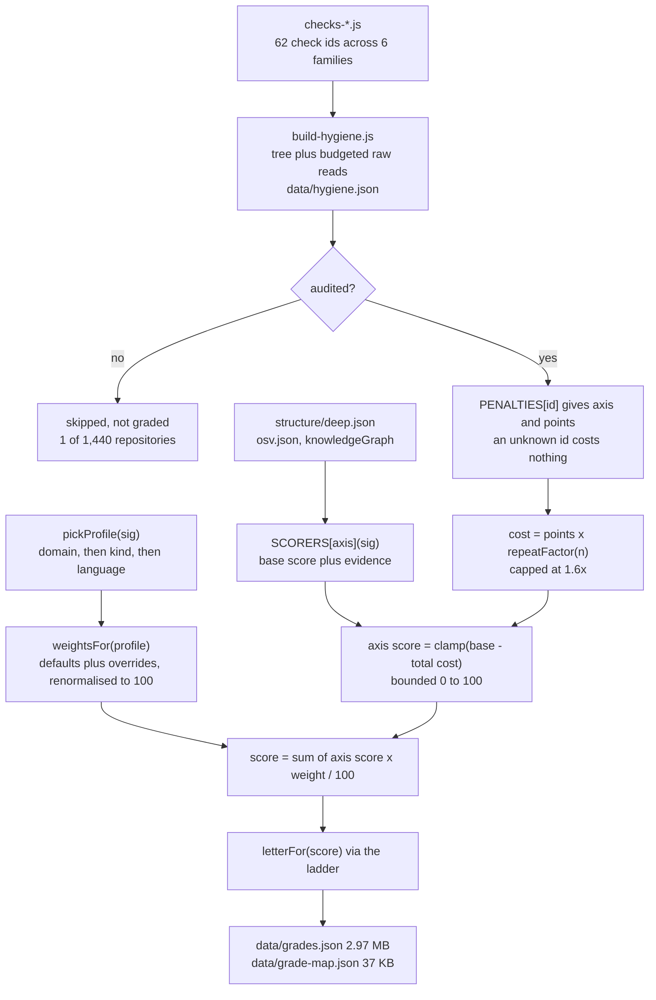
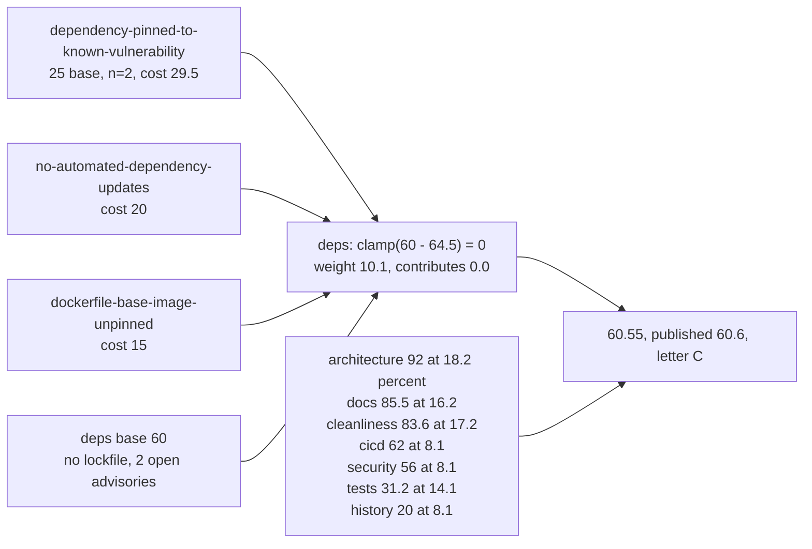

**Status:** DERIVED - every figure read from the files listed below or computed from them.
**Sources:** `scripts/lib-grade.js`, `scripts/build-hygiene.js`, `scripts/build-grade.js`, `scripts/test-grade.js`, `scripts/checks-ci.js`, `scripts/checks-hygiene.js`, `scripts/checks-osv.js`, `scripts/checks-quality.js`, `scripts/checks-runtime.js`, `scripts/checks-secrets.js`, `scripts/checks-supply.js`, `data/grades.json`, `data/grade-map.json`, `data/hygiene.json`, `forks.json`

# The scorer

Glossa audits an estate of 1,440 repositories (`forks.json`), most of them forks of other
people's open source. A reader who opens forty of them cannot hold forty finding lists in
their head, so each audited repository carries one letter. The letter is only defensible if
it is reproducible and if every point of it traces back to a check that actually ran.

Nothing in the scorer calls a model or the network. `scripts/build-grade.js` is a join over
files already on disk: `forks.json` for repository facts, `data/hygiene.json` for the audit,
`structure/<id>.deep.json` for the module-level pass, `data/osv.json` for advisories.

## The path from a finding to a letter

## The eight axes

Weights below are the defaults in `CATEGORIES`; they already sum to 100, so a weight reads
as a percentage of the grade without further arithmetic. `PENALTIES` holds 62 entries, one
per check id that exists.

| Axis | Label | Default weight | Penalty ids charged | Base score when nothing fired |
|---|---|---|---|---|
| `architecture` | Architecture & Robustness | 21 | 1 | 92 from the deep pass; 55 and `partial` without one |
| `cleanliness` | Code Cleanliness | 17 | 5 | 95 less medium/low density; 60 and `partial` without a deep pass |
| `docs` | Docs & Onboarding | 14 | 4 | 70 with a README, plus 8 for a licence, plus 2.5 per doc file to a cap of 18 |
| `tests` | Test Coverage | 12 | 3 | 92 at one test file per ten; 25 at one per sixty; 0 with none |
| `cicd` | CI/CD Maturity | 10 | 8 | 85 if a pipeline is configured, 0 if not |
| `deps` | Dependency Health | 10 | 8 | 88 with a lockfile, 60 without, less 6 per open advisory to a cap of 55 |
| `security` | Security Hygiene | 8 | 33 | 90 flat |
| `history` | History & Maintenance | 8 | 0 | 95 inside 30 days, 20 past 730, linear between |

Two design choices are worth naming. High-severity structural findings are charged to
architecture and medium and low ones to cleanliness, so no finding is billed to two axes.
Security has no structural proxy: it starts at 90 and is only ever lowered by a check that
fired, and the evidence line says "no secret or runtime check fired" rather than claiming
the repository is secure. History carries no penalty ids at all, which is why the worst
possible repository still scores above zero.

## The check families

| File | Ids | What it audits |
|---|---|---|
| `checks-secrets.js` | 13 | Committed credentials and sensitive data, with file contents read rather than filenames matched |
| `checks-runtime.js` | 13 | How the program behaves once running: CORS, TLS verification, deserialisation, injection |
| `checks-ci.js` | 16 | Workflow safety: token scope, untrusted checkout, false green |
| `checks-quality.js` | 12 | Verification, licensing, reproducibility, notebook hygiene |
| `checks-supply.js` | 5 | Lockfiles, update bots, base-image pinning, install lifecycle scripts |
| `checks-osv.js` | 3 | Named advisories, by CVE, against the versions the manifest asks for |

`checks-hygiene.js` declares no ids of its own; requiring it registers the other five
catalogues. The six files together hold 62 unique ids, exactly matching `PENALTIES`.

## Why profiles exist

A notebook collection has no reason to own a build pipeline, and grading it on one measures
something that was never meant to be there. A library is consumed by other code, so its
interface docs and tests carry more than its deployment story. Infrastructure is where a
committed credential is not a smell but an incident. `PROFILES` lists only the axes that
genuinely differ; an axis left out keeps its default weight, and the whole set is
renormalised back to 100 by `weightsFor`.

| Profile | Renormalised weights (arch / clean / docs / tests / cicd / deps / sec / hist) | Repositories |
|---|---|---|
| `frontend` | 21 / 17 / 14 / 12 / 10 / 10 / 8 / 8 | 696 |
| `default` | 21 / 17 / 14 / 12 / 10 / 10 / 8 / 8 | 274 |
| `service` | 19 / 16.2 / 9.5 / 13.3 / 13.3 / 9.5 / 11.4 / 7.6 | 166 |
| `cli` | 18.2 / 17.2 / 16.2 / 14.1 / 8.1 / 10.1 / 8.1 / 8.1 | 122 |
| `docs` | 8.9 / 22.2 / 37.8 / 2.2 / 4.4 / 6.7 / 8.9 / 8.9 | 89 |
| `library` | 18.9 / 15.1 / 17 / 17 / 7.5 / 9.4 / 7.5 / 7.5 | 71 |
| `notebook` | 14.9 / 23.4 / 21.3 / 4.3 / 4.3 / 10.6 / 8.5 / 12.8 | 21 |
| `infra` | 15.1 / 11.3 / 13.2 / 5.7 / 15.1 / 9.4 / 22.6 / 7.5 | 0 |

`frontend` and `default` are numerically identical because the `frontend` override restates
four default weights; the profile still exists so the report can name what a repository was
graded as. `infra` is defined but no repository in the current estate resolves to it.

`pickProfile` reads the domain first (`Agent Skills & Plugins` becomes `docs`, because a
skills pack is prose an agent reads), then the classifier's `kind`, and only falls back to
the dominant language as a tie-break. The profile is published next to the grade rather
than hidden inside it.

## The ladder

`LADDER` maps a score to a letter: 90 A, 85 A-, 80 B+, 75 B, 70 B-, 65 C+, 60 C, 50 C-,
40 D, 0 F. `nextGrade` reports the distance to the letter above, because "0.2 points from a
D" is a to-do and "39.8 out of 100" is only a verdict.

Across the 1,439 graded repositories the mean is 60.5 and the distribution is:
A- 2, B+ 23, B 68, B- 163, C+ 218, C 259, C- 522, D 170, F 14. No repository reaches A.

## Tracing one grade backwards

`data/grades.json` keeps every axis, weight, evidence line and charged finding, so the
report shows the arithmetic instead of asserting the total. Repository 625041724, "Auto
GPT", graded `cli`, score 60.6, letter C, 4.4 points short of C+:

The deps axis is the clearest case of the deduction model: a base of 60 for a manifest with
no lockfile, then 64.5 points of charged findings, clamped at zero. Axes floor
independently, so a wrecked axis costs its weight and no more. The cost of 29.5 on the first
finding is 25 base points multiplied by `repeatFactor(2)`, which is 1.18.

## The honesty properties

These are the properties `scripts/test-grade.js` pins down, because each of them, if broken,
would turn the letter into a false claim rather than merely a wrong number.

**An unaudited repository is skipped, not graded from defaults.** `build-grade.js` reads
`hygiene[id]` and continues past the repository when it is missing, counting it as skipped;
it never reaches `grade()`. An F awarded because nothing has looked at the repository yet is
a false claim. `grade()` also reports `audited: false` for a signature with no hygiene
block, and the test asserts it. `data/grade-map.json` carries the note "An id absent from
this file has not been audited, which is not a grade", and the test asserts that sentence is
present and that the unaudited colour in `assets/js/graph-grade.js` is not one of the grade
band colours. 1,439 of the 1,440 repositories are audited and graded; one is skipped.

**An axis with no module-level analysis is marked `partial` rather than scored as clean.**
`scoreArchitecture` and `scoreCleanliness` return `{ score: 55, partial: true }` and
`{ score: 60, partial: true }` when there is no deep pass, or when it resolved fewer than
`MIN_MODULES` (3) modules - an import graph that small says the analyser found no structure
to measure, not that the structure it found is perfect. Both sit well below the 92 and 95 a
clean deep pass earns. The tests check that a missing deep pass sets `partial`, that
architecture then scores below 92, and that a one-module graph is treated as no analysis.
400 of the 1,439 grades carry the flag, and `grade-map.json` carries it per repository as
the third element of `[score, letter, partial]`, so a partially measured grade cannot be
drawn as though it were fully measured.

**Repeat findings compound sublinearly and are capped.** `repeatFactor(n)` is
`min(1.6, 1 + log2(n) * 0.18)`: 1.0 at one occurrence, 1.18 at two, 1.42 at five, 1.60 at
ten, and 1.60 for every count above that - 30 and 10,000 both return exactly 1.6. A finding
that fires thirty times is worse than one that fires once, but not thirty times worse, and a
linear charge would zero an axis on a single noisy check. The test asserts
`repeatFactor(1) === 1`, `repeatFactor(5) > 1` and `repeatFactor(10000) <= 1.6`.

The suite also pins determinism (the same inputs must grade identically, which is why
`scoreHistory` measures against the audit date rather than the clock), that every profile
weights all eight axes and none zeroes one, that every profile's weights sum to 100 within
1e-9, that every check id in `checks-*.js` is charged to an axis and no penalty names a
check that no longer exists, and that `grade-map.json` agrees with `grades.json` on every
score, letter and partial flag.

## Two things worth knowing

The weight stored on each category is rounded to one decimal place before the weighted sum
is taken, so the rounded weights of some profiles do not sum to exactly 100: `cli` sums to
100.1, `service` to 99.8. The test's 1e-9 tolerance is applied to `weightsFor`, which is
unrounded, so the rounding drift in the published figures is not covered by it. The effect
on a score is at most a couple of tenths.

`build-hygiene.js` records a `truncated` flag when a repository's tree is too large to be
returned in full, so a finding from a partial tree is never read as complete coverage. That
flag is recorded at audit time; `lib-grade.js` does not consult it, and a truncated tree
therefore does not set the `partial` flag on the grade.
