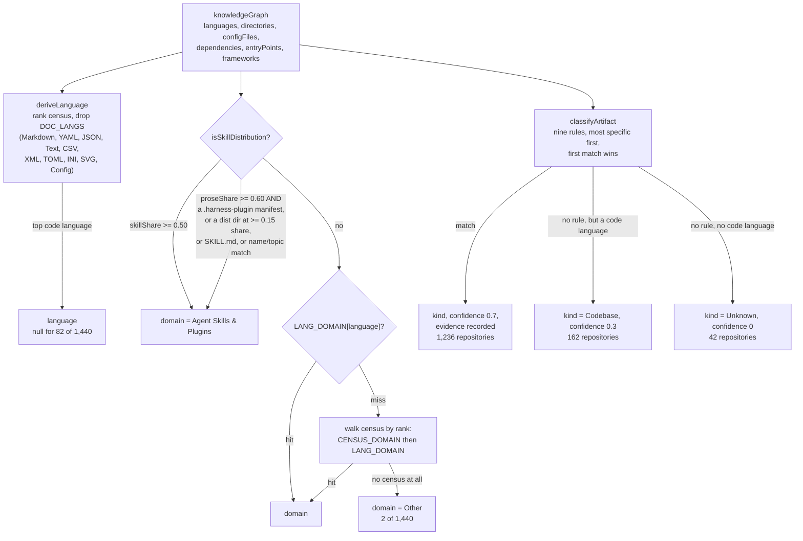
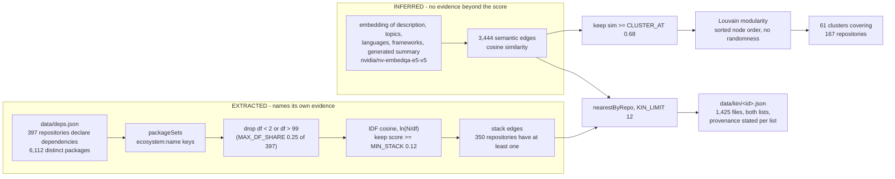

**Status:** DERIVED - every figure read from the files listed below or computed from them.
**Sources:** `scripts/lib-classify.js`, `scripts/test-classify.js`, `scripts/lib-relations.js`, `scripts/build-relations.js`, `scripts/lib-subprojects.js`, `data/relations.json`, `data/clusters.json`, `data/deps.json`, `data/kin/`, `forks.json`

# Domains, kinds and clusters

Two separate things happen in this layer, and confusing them is the easiest way to
misread the estate.

**Classification** answers a question about one repository on its own: what is it, and
what field is it in. Each of the 1,440 repositories in `forks.json` gets a `kind`, a
`domain`, a list of `kindEvidence` strings and a `kindConfidence`, all from the file
census rather than from the GitHub API.

**Grouping** answers a question about pairs: which repositories belong beside which
others. It draws two kinds of edge between repositories, then partitions the semantic
edges into communities.

A third concern, sub-project detection, cuts across both: some repositories are not one
codebase but a shelf of separate projects, which changes both how they are described and
how they are counted.

## Classification

`enrichFork` in `scripts/lib-classify.js` runs three derivations over the knowledge graph
that the census pass already built for each repository.

`domainOf` checks the skill-distribution test *before* the language, because those are
exactly the repositories whose dominant language says nothing about what they are: a
skills pack with two JavaScript files among a hundred and fifty Markdown ones is not a
web project. The test is share of the tree, not presence of a directory. `.claude` sits
in a large number of repositories simply because someone used the tool there once; a
`.claude-plugin` manifest alone was, for one revision, enough to reclassify a
12,769-file design tool, which is why `test-classify.js` now asserts the opposite case
directly.

`Other` is reserved for the case it should actually mean - a repository whose tree was
never censused. It holds 2 repositories. `test-classify.js` asserts that it stays under
2 per cent of the estate, and that every language present in the index is placeable by
`LANG_DOMAIN` or `CENSUS_DOMAIN`, because the failure mode here is silent: nothing
errors, the bucket just grows.

### Domain taxonomy

Counts from `forks.json` (1,440 repositories).

| Domain | Repositories | Assigned from |
| --- | --- | --- |
| Web & Interfaces | 508 | TypeScript, TSX, JavaScript, JSX, Vue, Svelte, Astro, HTML, CSS, SCSS, Less, Ruby, PHP, Elixir; SVG by census |
| AI & Data | 482 | Python, Jupyter Notebook, R, Julia, SQL |
| Systems & Infra | 286 | Go, Rust, C, C++, headers, Java, C#, Zig, Lua, Solidity, Shell, Terraform, HCL, Dockerfile, Makefile, Perl, Scala, Haskell, Nix; YAML/TOML/INI by census |
| Knowledge & Content | 55 | census only: Markdown, reStructuredText, Text, CSV, JSON, XML |
| Agent Skills & Plugins | 54 | `isSkillDistribution`, checked ahead of language |
| Mobile | 53 | Swift, Kotlin, Dart, Objective-C |
| Other | 2 | no census |

### Kinds

`classifyArtifact` runs nine ordered rules. Each carries a `why()` closure, so the
evidence is stored alongside the answer rather than the answer being asserted - 1,398 of
1,440 repositories carry at least one evidence string.

| Kind | Repositories | Test |
| --- | --- | --- |
| Web app | 704 | React/Next/Vue/Svelte/Astro/Nuxt/Remix/Angular framework, or a front-end build config |
| Service / API | 169 | Docker plus compose/k8s/helm, or a server framework |
| Codebase | 162 | fallback: a code language and no distinguishing manifest |
| CLI tool | 122 | a `cli`/`main`/`cmd` entry point, or a `cmd/` or `bin/` directory |
| Mobile app | 99 | a mobile toolchain file, or Swift/Dart/Kotlin above 20 per cent of the tree |
| Library / SDK | 72 | a package manifest **and** a test suite |
| Docs / content | 52 | Markdown above 50 per cent of files |
| Unknown | 42 | no usable census |
| Notebook / research | 18 | Jupyter notebooks above 15 per cent of files |
| Browser extension | 0 | an extension manifest with a background or content script |
| Infrastructure | 0 | Terraform files, or an ansible/terraform/helm directory |

Two rules match nothing in the current estate. That is worth stating rather than hiding:
the rules are live, they simply have no subjects. Note also that `Infrastructure` sits
last, after `Service / API` and `CLI tool`, so a Terraform repository that also ships
compose files is filed as a service - the order is part of the definition.

`kindConfidence` is coarse by design and takes exactly three values: 0.7 when a rule
fired (1,236 repositories), 0.3 for the `Codebase` fallback (162), and 0 for `Unknown`
(42). It is a statement about which branch was taken, not a calibrated probability, and
should not be read as one.

## Grouping

### Why similarity is not evidence

A semantic edge is a cosine score between two embeddings of text that itself includes a
generated summary. There is nothing to inspect: `data/relations.json` records the
semantic edge type's `evidence` as "none beyond the similarity score itself". It cannot
be checked, only believed or not.

A stack edge is the opposite. It comes from packages both repositories declare in a
committed manifest, and each edge carries the names of the up to six that contributed
most weight, so a reader can open the two manifests and disagree. That is why every
`data/kin/<id>.json` restates `provenance: { semantic: "INFERRED", stack: "EXTRACTED" }`
rather than relying on the reader having seen the manifest - somebody who fetches one
neighbourhood file and nothing else still has to know which half is measured.

The pair is more useful than either alone. When a repository appears in both lists, the
extracted edge corroborates the inferred one, and that agreement is the strongest signal
in the layer.

### Why the document-frequency ceiling exists

Without it, `typescript` (159 of 397 repositories), `@types/node` (124), `react` (109),
`react-dom` (105) and `@types/react` (101) would each generate tens of thousands of pairs
and relate most of the estate to most of the rest. Five packages sit above the cap of 99.
IDF already reduces their weight to nearly nothing, so the ceiling is not really about
score quality - it is about not spending the compute to enumerate hundreds of thousands
of pairs in order to score them near zero. Packages appearing in only one repository are
skipped too: they cannot pair with anything.

### Why the clustering had to be deterministic

`data/clusters.json` is committed to the repository. A clustering seeded randomly, or one
that iterated nodes in hash order, would reshuffle group ids on every nightly build and
produce a large diff that means nothing. `communities()` therefore sorts node ids at every
level and uses no randomness anywhere, with fixed bounds (`MAX_LEVELS` 12, `MAX_PASSES`
20) so a pathological graph cannot make the build hang.

Louvain replaced union-find single-link clustering, which is still present as `cluster()`.
Connected components ask whether a path of strong links exists between two repositories,
and the answer was yes far too often - one bridging repository welded two unrelated
neighbourhoods into a group of twenty. Modularity asks whether a set is linked more
densely to itself than chance predicts, so a bridge node joins whichever side it is more
tied to. Same edge list, same 0.68 threshold, so every Louvain group is a subset of some
component; it is a refinement, not a different graph.

The result is 61 clusters covering 167 repositories - 48 pairs, 7 triples, one of 4, two
of 5, one of 6 and two of 15. 22 of the 61 span more than one domain, which is the
interesting case rather than a defect: the same problem solved twice in two different
stacks. The largest cluster mixes 7 Agent Skills & Plugins repositories with 5 Web &
Interfaces and 3 AI & Data, keeper `openskills`, mean grade 70.4. The other 15-member
cluster is 12 Web & Interfaces, 2 AI & Data and 1 Systems & Infra, keeper `openwiki`.
Every clustered repository in the current build is graded, so `ungraded` is 0 throughout.

Coverage is stated honestly in `data/relations.json`: 350 of the 397 repositories that
declare dependencies have a stack edge. The denominator is deliberately not 1,440, since
most trees carry no manifest this pipeline reads and counting those as misses would report
a working join as a broken one.

## Sub-project detection

Some repositories are a shelf rather than a project. `detectSubProjects` groups the file
tree by top-level directory, counts code, notebooks, data and docs in each, and keeps
those with at least one code file. `NOT_A_PROJECT` filters out two different things: build
and asset noise (`node_modules`, `dist`, `assets`, `data`), and - the group that actually
matters for counting - conventional architecture names (`src`, `api`, `frontend`,
`backend`, `notebooks`, `models`). A layered application with `src/`, `api/`, `dashboard/`
and `notebooks/` looks exactly like four projects to a directory count, and one repository
was misread that way before those names went in.

`isCollection` requires at least 4 surviving sub-projects holding at least half the files.
Two side-by-side directories are a coincidence; the threshold is deliberately not 2.
`projectCount` then returns either 1 or the number on the shelf, re-filtering the stored
`subProjects` through `NOT_A_PROJECT` so an extension to that set takes effect without
re-walking every tree.

Across `forks.json`, 1,219 repositories carry a stored `subProjects` list and 180 pass the
collection test - 64 in AI & Data, 63 in Web & Interfaces, 52 in Systems & Infra, 1 in
Agent Skills & Plugins. Counting projects instead of repositories takes the estate from
1,440 to 2,542. The largest shelves are `CLI-Anything` (74), `tailscale` (56), `Vpnnode`
(31), `Data-Science-Machine-Learning` (29) and `hyperbrowser-app-examples` (29).

The effect on description is the point. A collection has no single thing to describe, so a
briefing that treats it as one codebase says nothing. Detection is what lets the shelf be
described shelf by shelf, and 2,542 is the truer measure of original work for the same
reason.

One caveat: `projectCount` reads stored `subProjects` and applies no minimum size, so
`tailscale` and `git` register as collections on directory structure alone. The heuristic
measures layout, not authorship, and does not distinguish a shelf of personal projects
from a large upstream codebase with many top-level packages.
