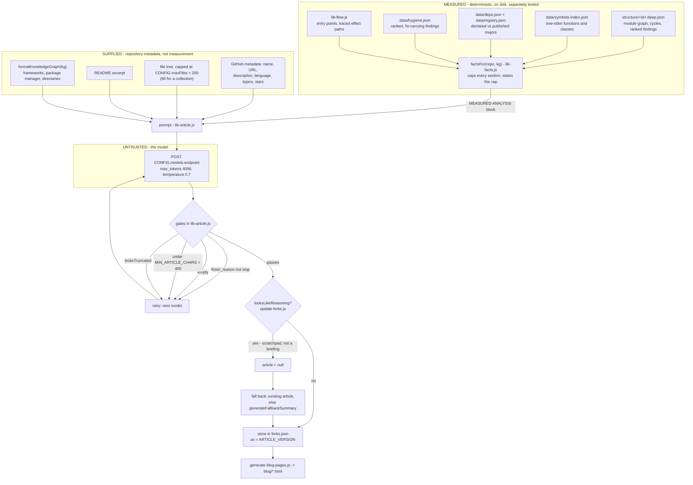
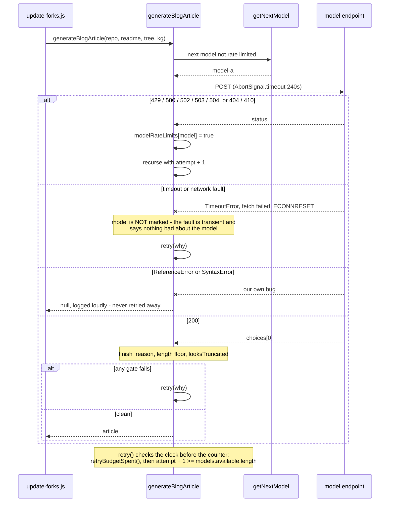

# Generation

**Status:** DERIVED for the code paths and limits; the trust argument is AUTHORED.
**Sources:** `src/lib/lib-article.js`, `src/lib/lib-facts.js`, `src/lib/lib-config.js`, `src/lib/lib-knowledge-graph.js`, `src/lib/lib-quality.js`, `src/lib/lib-article-version.js`, `src/lib/lib-github.js`, `src/stages/update-forks.js`, `src/site/generate-blog-pages.js`, `tests/test-quality.js`, `.github/workflows/update-forks.yml`, `blog/ATLAS.html`

## The separation

Glossa publishes technical briefings about repositories nobody has described by hand. Everything a published article asserts numerically — module counts, import edges, cycles, call-graph fan-in, dependency majors behind, hygiene findings — is produced by the deterministic pipeline and reaches the model already stated. The model's job is to arrange those statements into prose an engineer can read.

The rule is one sentence: **the model writes prose, never a number.** It has no way to compute one, and the prompt tells it not to try. Everything downstream of that rule — the fact block, the prohibitions, the retry ladder, the publish gates — exists to keep the boundary from leaking.

The two halves never mix. `factsFor` is pure of the model: it reads four JSON artefacts plus the flow analysis, formats them, and is exercised on its own. The model receives that text and is instructed to report it, not to reproduce the analysis.

## How a fact reaches the model

`factsFor(repo, kg)` in `src/lib/lib-facts.js` returns a prompt-ready block, or `''` when nothing has been measured — and the file's own comment insists absence is normal, because "analysis lags the feed by design". The block is assembled from labelled sections, each capped by a named constant (`MAX_HUBS` 8, `MAX_FINDINGS` 14, `MAX_SYMBOLS` 16, `MAX_STALE` 8, `MAX_PROJECTS` 18, `MAX_HYGIENE` 10, `MAX_FANIN` 12, `MAX_EDGES` 14). When a cap bites, the text says so — `... and N lower-ranked findings` — rather than truncating silently, because a silent truncation would let the model read an incomplete list as a complete one.

The section headers are themselves the contract, and the prompt names them back: `IMPORT GRAPH`, `MOST CONNECTED MODULES`, `MEASURED FINDINGS`, `INTERNAL CALL GRAPH`, `ENTRY POINTS`, `WHAT THIS CODE TOUCHES OUTSIDE ITSELF`, `WHAT EACH FILE IS RESPONSIBLE FOR`, `NAMED SYMBOLS`, `REPOSITORY HYGIENE (detected, do not contradict)`, `CODE HEALTH AUDIT`, `DECLARED DEPENDENCIES`.

The block is introduced in the context with a framing that is doing real work:

> `MEASURED ANALYSIS - deterministic, produced by this pipeline's static analysis. These are facts, not guesses. Use them; do not contradict or pad them:`

Several sections exist because their absence produced a specific fabrication. The hygiene line is there because, per the comment in `lib-facts.js`, "the model invented 'no LICENSE file' for a repo that has one, because these were measured but never shown to it". The collection block is there because a model told to describe "the architecture" of 29 unrelated projects can only generalise. A gap in the context is not neutral; the model fills it.

## What the prompt forbids

Quoted verbatim from `src/lib/lib-article.js`.

On wiring, in the `## How It Is Wired` section:

> `Never invent an edge, a path or an effect that is not in those blocks; where one is absent, say the wiring has not been mapped for this repository yet.`

This is the core of the separation. The model may narrate control flow only over edges the call-graph analysis resolved, and it is given an explicit sanctioned way to say nothing — which matters, because a model with no escape hatch invents one.

On the measured findings, in `## Code Health & Issues`:

> `If a MEASURED ANALYSIS block is present, this section reports it. Lead with what it found, quoting the real counts and the real file paths, and say plainly that it comes from static analysis rather than opinion. Do not add invented issues alongside it, do not soften or inflate its numbers, and do not repeat the same finding kind more than once - it is already grouped with a count.`

And the fallback when there is nothing:

> `With no measured block, say that deep analysis has not run for this repo yet and keep this section to what the structure genuinely supports.`

On setup instructions, in `## How To Use It`:

> `If the repo gives no evidence for a step, say what is missing instead of inventing a plausible command.`

Reinforced in the `NEVER USE` list by a single line:

> `- Inventing setup commands, flags, or env var names with no evidence in the repo`

The rest of `NEVER USE` is register rather than provenance — buzzword filler, empty openers, hype, sarcasm, and "Starting multiple sentences with 'This' or 'The'". The named banned terms are enforced twice: the prompt forbids them, and `BAD_PHRASES` in `lib-quality.js` queues for regeneration any article that contains one anyway (`is paramount`, `game-changer`, `cutting-edge`, `comprehensive solution`, among others).

The clone URL is handed over with `(use this verbatim in any clone command)` — the model is not asked to reconstruct a URL it can get wrong.

## Configuration

From `src/lib/lib-config.js`, all overridable by environment variable:

| Setting | Default | Why |
| --- | --- | --- |
| `LLM_ENDPOINT` | `https://integrate.api.nvidia.com/v1/chat/completions` | OpenAI-shaped chat completions |
| `LLM_MODELS` | `openai/gpt-oss-120b`, `nvidia/nemotron-3.5-lightning-30b-a3b`, `deepseek-ai/deepseek-v4-flash-0731` | the rotation |
| `LLM_TIMEOUT_MS` | `240000` | "120s aborted legitimate work on large prompts" |
| `LLM_MAX_TOKENS` | `4096` | see below |
| `LLM_TEMPERATURE` | `0.7` | |
| `LLM_RETRY_BUDGET_MS` | `3600000` | wall clock on retrying |
| `API_DELAY` | `1600` | "40 rpm account ceiling" |
| `BATCH_SIZE` | `10` | repositories per run |

The token ceiling has the most instructive history. The comment records that `2000` "put the ceiling exactly on the length the prompt asks for": the prompt says "Keep it under 550 words", the median stored article is 3,503 characters, and 66 of 1,350 ended mid-sentence because a briefing that ran slightly long — or a reasoning model that spent part of the same budget thinking — hit the cap and was guillotined. The raise to 4,096 is explicitly headroom, not a longer target: "the word limit in the prompt is what governs length, and this only stops the limit being enforced by truncation. Billing is on tokens produced, so the raise costs nothing on its own."

`getNextModel()` walks the rotation from `currentModelIndex`, skips anything marked in `modelRateLimits`, advances the index past whatever it returned, and returns `null` when every model is marked. That state is module-level in `lib-config.js` on purpose: two copies of "which models are rate limited" would mean the rotation silently stopped working.

## Failure handling

**Rate limit and unavailability.** A `429`, `500`, `502`, `503`, `504`, `404` or `410` marks the model in `modelRateLimits` and recurses immediately. `404` and `410` additionally log that the slug is retired or not available on this account, with a nudge to update `LLM_MODELS`. Because the model is marked first, this path terminates on its own — `getNextModel` eventually starves — but it shares the same `attempt` bound anyway, so that "no future edit can reintroduce an unbounded recursion here".

**Timeout.** `AbortSignal.timeout(LLM_TIMEOUT_MS)` bounds the request, because "a hung request stalled the whole run". A timeout used to return `null`, which the code comment calls out as the worst possible choice: "the one failure a retry fixes most reliably was the only one that did not retry. In a real run all five timeouts were the same model in a degraded window while another model in the rotation answered every single time, one line away." A timed-out model is deliberately not marked dead — the fault is transient, so marking it would be wrong, and that is precisely why the transient path needs its own recursion bound of one pass over the rotation.

**Truncation.** Two checks, in that order. `finish_reason` is read directly: anything other than `"stop"` retries. Then `looksTruncated` from `lib-quality.js` acts as belt to that braces, because "some providers report 'stop' on a response that plainly is not finished, and the stored corpus is the evidence that this happens". The predicate is deliberately crude — it tests the last character against a punctuation class, with a trailing code fence treated as clean — because that is what the failure actually looks like: prose, a table row, a closing fence and a bolded label all end on punctuation; a guillotined sentence ends on a letter.

**Why a truncated article was previously published silently.** Two independent omissions had to coincide. `max_tokens` sat at 2,000, right on the length the prompt requests, so a slightly long briefing was cut off by the API rather than ended by the model. And nothing in the code read `finish_reason`, the one field that said so. The result was 67 of 1,350 stored summaries ending mid-thought — `sift-kg` stopping on the bare word "Extraction", `llama.cpp` on "cross-platform LLM inference runtime with first-" — spanning every length up to 4,746 characters, so it was never a matter of the model having little to say. The page rendered fine. Nothing failed. The article was simply half an article, and it stayed on the site.

The length floor is separate and earlier: `MIN_ARTICLE_CHARS` is 400, and the floor is tested before the shape so the log names the more fundamental fault. That check was once "a bare `return null`, which is why two repos in one run logged 'fallback' with nothing above them saying what went wrong".

**Code faults stay loud.** A `ReferenceError` or `SyntaxError` is never retried, even when its message happens to match the transient regex. The comment explains why: two missing imports survived a module split and surfaced only in CI days later, on the branch that runs when a model times out. Retrying that three times and returning a fallback would have buried it. `generateFallbackSummary` is imported at the top of `lib-article.js` with a note that a missing import there "fails only in the situation the code exists to handle. It failed exactly that way in CI."

**Reasoning leaks.** Caught one layer up, in `update-forks.js`: `looksLikeReasoning(article)` rejects the model's scratchpad — the prompt echoed back, then deliberation about how to comply, then the article. 110 of 1,297 stored summaries (8.5%) were this, averaging 7,839 characters against 3,220 for a clean one. Rejecting rather than storing lets the normal retry path pick the repository up with another model on a later run. The same predicate is imported by `generate-blog-pages.js`, so a stored leak cannot be published either.

**The retry budget.** `retryBudgetSpent()` is checked *before* the attempt counter. The workflow runs on a 2-hour cron with `cancel-in-progress: true`, and measured over three days runs took 27 to 132 minutes, with 8 of the last 20 cancelled at the 120-minute line by their successor, discarding everything uncommitted. Retrying a timeout raises the worst case per repository from one 240s abort to three. So past the budget, retries stop and the caller keeps what it has: "a thin article that lands is worth more than a better one that never gets written". A budget of zero or less, or one that fails to parse, counts as spent — never as unlimited, since `parseInt('twenty minutes')` is `NaN` and every comparison against `NaN` is false.

**Last resort.** With no API key at all, or after every path above has failed, `update-forks.js` prefers in order: the new article, the existing stored one, then `generateFallbackSummary(repo)` — two sentences composed from the repository's description and language that say nothing about the code. Its phrases are listed in `BAD_PHRASES`, so a fallback is always recognisable as one and always queued for regeneration.

## Scheduling

`update-forks.js` partitions repositories into those with a good stored article and those needing generation. "Good" means all three gates pass: `articleIsCurrent(existing)` (the stored `av` matches `ARTICLE_VERSION`, currently 2), `!isFallbackArticle(existing.summary)`, and `!looksLikeReasoning(existing.summary)`. The rest are split into never-attempted and awaiting-retry, and a batch of `CONFIG.batchSize` (10) is drawn with roughly 30% reserved for retries, so a repository that failed once is not starved behind the fresh queue forever. `CONFIG.apiDelay` (1,600 ms) separates calls. Three consecutive failures abandon model calls for the rest of the batch.

The brokenness gate and the staleness gate are deliberately distinct, and `lib-quality.js` explains why: 65 of the 66 truncated articles are stamped at the current `ARTICLE_VERSION`, so `articleIsCurrent` returns true for them and a version bump would never reach them. Broken text has to be caught by the brokenness gate or it stays on the site permanently.

## What is asserted

`tests/test-quality.js` runs hermetically against a stubbed `fetch` with a fixed three-model rotation (`model-a,model-b,model-c`) and no key or network. Each case scripts one reply per model and asserts both the returned article *and* how far the rotation got, "because 'returned something' would pass even if the retry never fired". It asserts that a clean article costs exactly one call; that `finish_reason=length`, a timeout, an under-floor article, a mid-sentence ending reported as `stop`, an empty article, and a network failure each advance to the next model and return its result; that a `ReferenceError` costs one call and returns `null`; that three timeouts stop after three distinct models rather than recursing; that a spent or unparseable budget stops the retry at one call; and that the default budget leaves the retry alone.

Note what is *not* asserted: no test checks that the model obeyed the prohibitions. The provenance separation is enforced structurally — by the model having no numbers of its own to offer — rather than by validating the prose afterwards. That is a deliberate design choice and also its honest limit. If a model stated a module count contradicting the `IMPORT GRAPH` block, nothing in the pipeline would currently notice.

## The output

A published briefing (`blog/ATLAS.html` is representative) carries the seven prompt sections as `h3` headings — The Problem, What This Does, How It Is Wired, How To Use It, Real-World Use, Code Health & Issues, The Bottom Line — followed by two `h2` sections rendered directly from the deterministic artefacts: "What the analyser found" and "What would stop me shipping this". The generated prose and the machine-rendered analysis sit on the same page under different headings, which is the trust separation made visible to the reader.

Markdown is stored intact. `stripMarkdown` used to run before storage, "which is why no article ever had a code block or a table: the prompt asked for both, the model produced both, and this line deleted them before anything could render them". The renderer escapes before it formats, so keeping the structure does not mean trusting the text.
