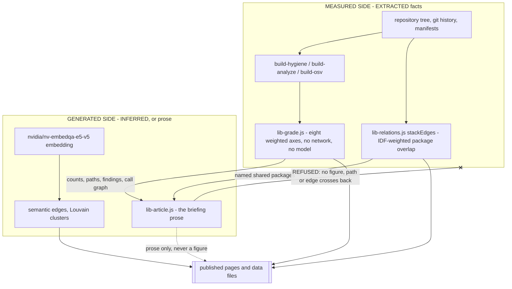

# The trust boundary

**Status:** AUTHORED - a design argument. Every rule is cross-referenced to the code that enforces it and the test that guards it.

**Sources:** `llms.txt`, `data/relations.json`, `stats.json`, `scripts/lib-relations.js`, `scripts/lib-grade.js`, `scripts/build-grade.js`, `scripts/build-relations.js`, `scripts/lib-article.js`, `assets/js/graph-grade.js`, `.githooks/pre-commit`, `scripts/test-grade.js`, `scripts/test-relations.js`, `scripts/test-globals.js`

## The problem this shape solves

`stats.json` records 1,440 repositories, of which 22 are original and 1,418 are forks:

```
"repos": 1440, "original": 22, "forked": 1418
```

Almost everything published here is a claim about somebody else's code. That
changes what publishing means. When the code is yours, a wrong sentence is an
opinion you can defend or retract; when it is not, a wrong sentence is an
assertion about a stranger's work, made at scale, by a machine. The only thing
that makes such a claim publishable is that it traces to a check that ran and
names what the check saw.

That is the whole design. It has one structural consequence: **provenance is a
property of a fact, not of the site.** A site-wide honesty claim is the easiest
thing here to get wrong, because nothing breaks when it stops being true - and
it did go wrong once. `scripts/test-relations.js` records the incident in the
test that now prevents it:

> llms.txt asserted that no language model produced any figure on the site,
> which was true of the grades and the audit and false of the similarity edges

So each fact carries its own tag. EXTRACTED means measured from a tree, a
history or a manifest, reproducible from the same inputs, and able to name its
evidence. INFERRED means a model's number, with no evidence beyond the number
itself. `data/relations.json` states this per edge type rather than once:

| | `stack` | `semantic` |
|---|---|---|
| provenance | `EXTRACTED` | `INFERRED` |
| derived from | dependency manifests committed to both repositories | neural embedding of description, topics, languages, frameworks and generated summary |
| evidence | "each edge names the shared packages that carried the most weight" | "none beyond the similarity score itself" |
| answers | "built the way you build things" | "probably solves the same problem" |

`clusterProvenance` is `"INFERRED - clusters are built from semantic edges only"`.
Clusters inherit the weaker of their inputs; provenance does not launder.

## The boundary



Read the arrows, because they are the argument. Measured facts flow *into* the
generated side: the article prompt is handed the call graph, the entry points,
the responsibility map and the measured analysis block. Nothing flows back. A
model may arrange, explain and judge; it may not supply a figure, a file path,
an edge or a command. The prompt in `scripts/lib-article.js` says so directly:

> Never invent an edge, a path or an effect that is not in those blocks; where
> one is absent, say the wiring has not been mapped for this repository yet.

and, on setup instructions:

> If the repo gives no evidence for a step, say what is missing instead of
> inventing a plausible command.

and, on the measured analysis section:

> Do not add invented issues alongside it, do not soften or inflate its numbers.

The one exception the design admits is the semantic edge, and it is not an
exception smuggled through - it is declared. The embedding is a model's number,
it is tagged `INFERRED`, the model is named, and `llms.txt` tells a reader to
"treat them as a strong hint, not as a measurement".

## The four rules

### 1. "Not analysed" must never render as "clean"

An axis with no module-level pass does not score well by default and does not
score badly either. It takes a neutral score and raises a flag. In
`scripts/lib-grade.js`:

```js
if (!t || !t.modules || t.modules < MIN_MODULES) {
  return { score: 55, partial: true, evidence: 'no module-level analysis available' };
}
```

with the reason stated above it: *"Without a deep pass the axis takes a neutral
score and is flagged partial, because 'not analyzed' must not read as 'clean'."*
Cleanliness does the same at 60. The flag propagates upward -
`partial: categories.some(c => c.partial)` - so a single unmeasured axis marks
the whole grade. In the graph it costs saturation, not band: *"the difference
between 'this is a C' and 'this is a C on incomplete evidence'."*

### 2. Unaudited is not a grade

`scripts/build-grade.js` skips rather than scores:

```js
const audit = hygiene[id];
if (!audit) { skipped++; continue; }
```

*"An F awarded because nothing has looked at the repository yet is a false
claim, and the page has to be able to tell the two apart."* The colour channel
carries the same rule into the pixels. `assets/js/graph-grade.js` defines
`var UNGRADED = '#4A4741';  // outside the scale on purpose`, with the reasoning
in the file header:

> It gets a colour outside the scale entirely - a hollow grey - because any
> position on a green-to-red ramp is a claim about quality that nothing measured
> supports. There is one such repository today and there were 497 in June; the
> treatment has to be right either way.

The legend is required to say it in words too: `'not audited - not a grade'`.

### 3. Provenance is per fact, not per page

Every edge carries its type. Every neighbourhood file at `/data/kin/<id>.json`
restates both provenance levels for a reader who fetched only that 1 KB file and
never saw the manifest. The graph traversal module labels both levels in the UI.
`llms.txt` names both and is forbidden from making the blanket claim. The
strongest signal on the site is defined as corroboration across the boundary:
*"a pair scoring on both is the strongest signal ... because the extracted edge
corroborates the inferred one."*

### 4. Coverage is reported against the denominator that makes it true

Stack edges do not cover the estate and the text never implies they do.
`scripts/build-relations.js` interpolates the real denominator rather than
typing a number:

```js
'- Stack edges exist only for the ' + manifest.counts.withDeclaredDependencies +
  ' repositories that declare dependencies in a manifest this pipeline reads.'
```

which renders as 397 of 1,440. Likewise "Grades cover 1439 of 1440
repositories. An absent grade means not yet audited, not a bad grade."

## Rule, enforcement, guard

| Rule | Enforced in | Guarded by |
|---|---|---|
| Missing module pass marks the grade `partial` | `lib-grade.js` `scoreArchitecture` / `scoreCleanliness`; propagated by `partial: categories.some(...)` | `test-grade.js`: `'a missing deep pass is flagged partial'`; `'a one-module graph is treated as no analysis'`; `'healthy repository is not flagged partial'` |
| `partial` survives into the colour map | `build-grade.js` slim map `[score, letter, partial]` | `test-globals.js`: `'every score, letter and partial flag matches the full file'` |
| Unaudited is skipped, not graded | `build-grade.js` `if (!audit) { skipped++; continue; }`; `audited: !!(sig.hygiene && sig.hygiene.audited)` | `test-grade.js`: `'an unaudited repository is marked unaudited'` |
| Unaudited sits outside the colour scale | `graph-grade.js` `UNGRADED` constant | `test-globals.js`: `'the unaudited colour is not one of the grade bands'` (asserts the hex is absent from `BANDS`); `'the legend says what unaudited means'` |
| An absent id is not a bad grade | `build-grade.js` writes the `note` field into `grade-map.json` | `test-globals.js`: `'the map states that an absent id is not a grade'` |
| Both edge types declare provenance | `data/relations.json` `edgeTypes.*.provenance` | `test-relations.js`: `'both edge types declare a provenance'` (literal `=== 'EXTRACTED'` / `=== 'INFERRED'`) |
| The inferred edge names its model | manifest `edgeTypes.semantic.model` | `test-relations.js`: `'the inferred edge names the model it came from'`; `'llms.txt discloses the embedding model by name'` |
| The extracted edge names its evidence | `lib-relations.js` `stackEdges` attaches the top six shared packages by IDF weight | `test-relations.js`: `'the extracted edge says what evidence it carries'` |
| Clusters inherit INFERRED | `clusterProvenance` in the manifest | `test-relations.js`: `'clusters inherit the provenance of the edges they are built from'` |
| No site-wide no-model claim | `llms.txt` wording | `test-relations.js`: `'llms.txt makes no blanket no-model claim'`; `'llms.txt names both provenance levels'` |
| Provenance repeats in every 1 KB kin file | the kin builder writes a `provenance` object per file | `test-relations.js`: `'a neighbourhood restates provenance for a reader who fetched only it'` |
| The model supplies no figures | prompt prohibitions in `lib-article.js` | **not guarded by a test** - see below |
| Coverage stated against its real denominator | `build-relations.js` interpolates `counts.withDeclaredDependencies` | **not directly guarded** - only the cluster count string is asserted against `llms.txt` |
| No key-shaped string may be committed | `.githooks/pre-commit` gate 1, matched against staged content | the hook itself; it also runs every `scripts/test-*.js` before allowing a commit |

## Where the rules are stated but not enforced

Two honest gaps, both on the generated side, which is exactly where a gap
matters most.

**The article prompt is unguarded.** Every prohibition in `lib-article.js` -
never invent an edge, never invent a command, never inflate the numbers - is a
sentence addressed to a model, not a check. No test asserts those clauses are
still present in the prompt, and no post-generation check compares a published
briefing against the measured blocks it was given. If someone edited the
prohibitions out, the suite would stay green. Contrast this with the relations
manifest, where the equivalent claims are asserted literally. The prompt is the
one place on the site where the trust boundary rests on wording alone.

**Rule 4 is enforced by construction rather than by assertion.** The
denominators in `llms.txt` cannot drift because they are interpolated from
`manifest.counts` at build time - which is a good arrangement, but it is not the
same as a guard. `test-relations.js` asserts only that the cluster count string
is present. If a future edit typed a coverage figure as a literal, nothing would
catch it. That is precisely the failure mode `test-globals.js` was written for
after the home page *"asserted 1,331 repositories for long enough that the real
number passed it by more than a hundred, with the same confidence as a measured
one."*

## The other boundary

`.githooks/pre-commit` guards a different direction of the same principle: not
what may be published about other people's code, but what may leave this machine
at all.

```
#   1. secrets    nothing key-shaped may enter this repo. It is public and
#                 Pages-served, so a leaked key is published, not just pushed.
```

It matches staged content rather than the working tree, *"so a key cannot slip
in via `git add -p` on a file that looks clean on disk"*, and it runs the whole
test suite on any staged `scripts/*.js` - which is what turns every assertion in
the table above from documentation into a gate. The hook's own comment names the
distinction: the unit tests *"existed but nothing ran them ... which makes them
documentation, not guardrails."*

That is the same argument twice. A rule nothing executes is a preference. The
boundary is real only where something refuses to cross it.
