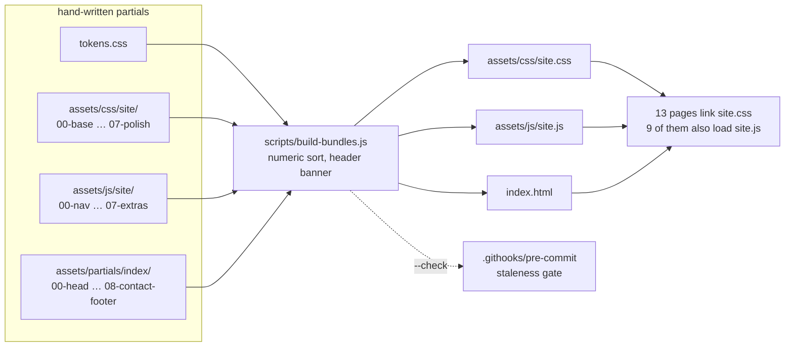
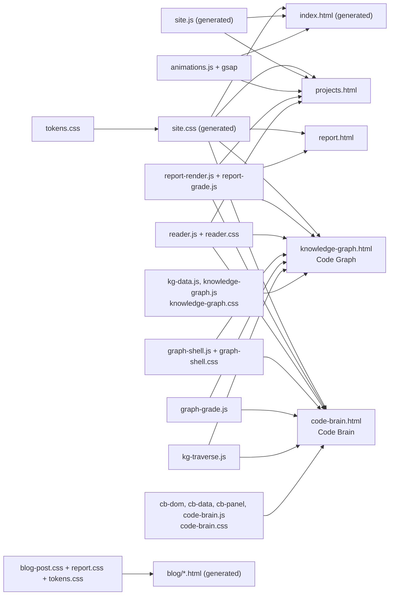

**Status:** DERIVED - every file list and line count measured from the repository.
**Sources:** `scripts/build-bundles.js`, `scripts/test-globals.js`, `.githooks/pre-commit`, `.githooks/loc-baseline.txt`, `assets/partials/index/`, `assets/css/site/`, `assets/js/site/`, `assets/css/tokens.css`, `assets/js/graph-shell.js`, `assets/css/graph-shell.css`, `assets/js/kg-traverse.js`, `assets/js/graph-grade.js`, `assets/js/kg-data.js`, `assets/js/cb-dom.js`, `assets/js/cb-data.js`, `assets/js/cb-panel.js`, `assets/js/knowledge-graph.js`, `assets/js/code-brain.js`, `knowledge-graph.html`, `code-brain.html`, `index.html`, `projects.html`, `report.html`, `blog/index.html`, `blog/ADR.html`

# 07 - Frontend

Glossa's interface is a static site on GitHub Pages. There is no framework, no
bundler and no build server: Pages serves the repository exactly as committed.
Every constraint below follows from that one fact.

## 1. The build seam

Three files in the repository are **generated**, not written:

| Output | Built from | Partials | Output lines |
| --- | --- | ---: | ---: |
| `index.html` | `assets/partials/index/` | 9 | 809 |
| `assets/css/site.css` | `assets/css/tokens.css` + `assets/css/site/` | 1 + 8 | 2,738 |
| `assets/js/site.js` | `assets/js/site/` | 8 | 1,133 |

`scripts/build-bundles.js` concatenates them. Editing an output directly is
wrong: the next rebuild discards the edit, and the pre-commit hook refuses a
commit in which a partial changed and its bundle did not.

### Why concatenate at all

Both bundles are loaded by many pages, so splitting either into separate files
would trade one request for eight on every page of the site. For the stylesheet
that is only a delivery argument. For the script it is a correctness one:
`site.js` is a flat classic script with a single shared top-level scope, and the
boot calls at the end must run after every declaration. Separate `<script>` tags
would change when each binding is initialised; concatenation preserves the scope
exactly, which is what makes the split provably behaviour-neutral rather than
probably so.

`index.html` is the third case and the simplest: HTML has no include mechanism
of its own, and the page was over the file-size limit purely on its own markup.

Order is filename order, and it is load-bearing in every case - the cascade for
the CSS, declaration order for the JS, document order for the markup. Hence the
numeric prefixes and an explicit numeric sort rather than trusting `readdir`.
`tokens.css` is prepended rather than kept as a partial, because the article
pages link it on its own and a second copy in the bundle would be a second place
for the accent to drift.

### Partial lists, as measured

All three lists in one table; the numeric prefix is the concatenation order.

| # | `assets/partials/index/` | Lines | `assets/css/site/` | Lines | `assets/js/site/` | Lines |
| --- | --- | ---: | --- | ---: | --- | ---: |
| 00 | `head.html` | 95 | `base.css` | 198 | `nav.js` | 127 |
| 01 | `nav.html` | 66 | `nav.css` | 266 | `hero.js` | 137 |
| 02 | `hero.html` | 99 | `hero.css` | 290 | `stats.js` | 247 |
| 03 | `findings-heatmap.html` | 143 | `widgets.css` | 392 | `index-records.js` | 56 |
| 04 | `about-skills.html` | 110 | `timeline.css` | 400 | `projects.js` | 239 |
| 05 | `experience.html` | 75 | `cards.css` | 406 | `repo-stats.js` | 167 |
| 06 | `projects-services.html` | 64 | `services.css` | 444 | `theme.js` | 123 |
| 07 | `opportunities-paths.html` | 82 | `polish.css` | 296 | `extras.js` | 112 |
| 08 | `contact-footer.html` | 77 | - | - | - | - |
| | **total** | **811** | **total** | **2,692** | **total** | **1,208** |

`tokens.css` (98 lines) is prepended ahead of `00-base.css`.

### The 450-line cap

`.githooks/pre-commit` refuses any staged `.js`, `.css`, `.html`, `.sh`, `.yml`
or `.yaml` file over `MAX_LINES=450`. Generated output is exempt by path -
`assets/css/site.css`, `assets/js/site.js`, `index.html`,
`assets/css/blog-post.css`, and everything under `blog/`, `data/`, `structure/`,
`Resume/`, `images/` and `node_modules/`. A grandfathered baseline lives in
`.githooks/loc-baseline.txt`, where a listed file may shrink but never grow;
**that file is currently empty (0 bytes)**, so nothing is grandfathered any more
and the cap applies flat.

The cap is a real design pressure, not decoration. It is why the three bundles
exist at all, why `code-brain.js` was cut into `cb-dom.js`, `cb-data.js` and
`cb-panel.js`, and why `initRailToggle` in `graph-shell.js` self-starts rather
than being called from the page scripts - both callers "were within a few lines
of the file-size cap". The widest CSS partial, `06-services.css` at 444, has six
lines of headroom.

## 2. The pages

**Home** (`index.html`, 809 generated lines) links `site.css` and loads gsap,
ScrollTrigger, `animations.js` (118) and `site.js`. **Projects** (200) adds
`projects.css` (126), `report.css` (289), `reader.css` (221),
`report-render.js` (292) and `reader.js` (306). **Report** (137) is the leanest
page: `site.css`, `report.css`, `report-grade.js` (86) and `report-render.js` -
no `site.js`, no animation libraries. `site.css` is linked by thirteen pages,
`site.js` by nine.

**Blog** pages are deliberately outside all of this. An article such as
`blog/ADR.html` links only `/assets/css/tokens.css`, `/assets/css/report.css`
and `/assets/css/blog-post.css`, plus mermaid from a CDN - no `site.css`, no
`site.js`. `blog/index.html` is a 17,512-line generated listing carrying its own
inline styles. Both fall under the generated exemptions, and `blog-post.css` is
exempt because it is written by `generate-blog-pages` from sources that are
themselves under the limit; ratcheting a build artifact would mean splitting the
source to satisfy a rule about its output.

### The two graph pages

`knowledge-graph.html` (141 lines, Code Graph) and `code-brain.html` (153, Code
Brain) load the same chrome in the same order: `3d-force-graph@1.73.4` from
unpkg, then `report-grade.js`, `report-render.js` and `reader.js`, then
`graph-shell.js` (127), then their own data layer, then `graph-grade.js` (152)
and `kg-traverse.js` (252), then their controller. Code Graph's data layer is
`kg-data.js` (222) feeding `knowledge-graph.js` (446); Code Brain's is
`cb-dom.js` (177), `cb-data.js` (291) and `cb-panel.js` (192) feeding
`code-brain.js` (440). Stylesheets: both link `graph-shell.css` (124 lines, 51
rules) and then their own - `knowledge-graph.css` (127 lines, 35 rules) or
`code-brain.css` (109 lines, 50 rules), which loads after it and overrides.

`graph-grade.js` and `kg-traverse.js` are genuinely shared: the grade colouring
and the provenance-aware neighbour walk both read the published
`/data/kin/<id>.json` layer rather than re-deriving anything, so both pages can
ask the same second question of their different pictures.

Everything is a classic script with no `defer` or `async`, deliberately: an
inline script and a plain external script have the same execution order, so the
extractions preserved behaviour exactly by keeping their document positions.

### Why the controllers stayed separate

`graph-shell.js` states the reason in its header:

> The honest finding after comparing them function by function is that most of
> the divergence is real: their build() bodies differ by 2,500 characters
> because one dives into files and modules and the other lays repositories out
> by meaning, and computeHighlight differs because the two graphs mean different
> things by "adjacent". Forcing those into one function behind a config object
> would produce something harder to read than the two it replaced.

What is shared is only the mechanical part - `fitToContainer`, `flyTo`,
`initRailToggle`, plus a self-starting `syncNavHeight`. "So this file is small on
purpose. It holds what both pages provably want, not everything that looked
similar."

The stylesheet made the opposite call, because the evidence differed: 39 rules
were byte-identical across the two page stylesheets while the rest had drifted.
`graph-shell.css` records the cost of that - "A slider written against `.cg-btn`
landed in the stylesheet the page did not load and silently did nothing, which is
how this file came to exist." Only byte-identical rules moved; anything that
genuinely differs stays in the page stylesheet.

## 3. What enforces the arrangement

`scripts/test-globals.js` holds the whole thing together. The graph pages share
state through `window` rather than modules, so a name that moves between files is
invisible to `node --check` and fails only at runtime. It declares two `GROUPS`:

- **code brain** - `cb-dom.js`, `cb-data.js`, `cb-panel.js`, `graph-shell.js`,
  `graph-grade.js`, `kg-traverse.js`, `code-brain.js`; provides `CBDom`,
  `CBData`, `CBPanel`, `GraphShell`, `GraphGrade`, `KGTraverse`.
- **semantic map** - `kg-data.js`, `graph-shell.js`, `graph-grade.js`,
  `kg-traverse.js`, `knowledge-graph.js`; provides `KGData`, `GraphShell`,
  `GraphGrade`, `KGTraverse`.

For each file it collects what is declared and what is reachable, and fails on
any identifier used as a value that resolves nowhere. It is a linter rather than
a parser and says so: its blind spot is scope, since it asks whether a name is
declared anywhere in the file rather than whether it is in scope at the point of
use.

The same script carries three further guards:

- **CSS drift guard.** It parses `graph-shell.css` and both page stylesheets and
  fails if a page stylesheet reintroduces a shell selector with a byte-identical
  body - the exact shape the duplication took the first time. It also fails if
  either page stops linking `graph-shell.css`, or drops
  `assets/js/graph-grade.js` or `id="grade-toggle"`.
- **Home page figures.** Every stated figure is a `` filled from
  `stats.json` rather than typed into the markup, because the hero once asserted
  1,331 repositories for long enough that the real number passed it by more than
  a hundred. The guard runs in both directions: a span nothing writes is a
  failure, and a `setNum` call for a span the page no longer has is a failure.
  Nine spans are checked today - `hero-repos`, `hero-forked`, `hero-scripts`,
  `pl-scripts`, `pl-suites`, `pl-assertions`, `pl-checks`, `pl-axes` and
  `pl-stages`, the last filled from the length of the stage list rather than from
  `stats.json`.
- **Arithmetic on `stats.json`.** `original + forked` must equal `repos`, the
  pipeline figures must all be non-zero, and `originalProjects` must not fall
  below `original`.

`.githooks/pre-commit` runs the whole `scripts/test-*.js` suite when a script is
staged, and runs `build-bundles.js --check` whenever anything under
`assets/css/site/`, `assets/js/site/` or `assets/partials/` is staged. That is
the seam closed: a committed artifact can go stale, so editing a partial without
rebuilding is refused at commit time rather than found later as a broken page.
