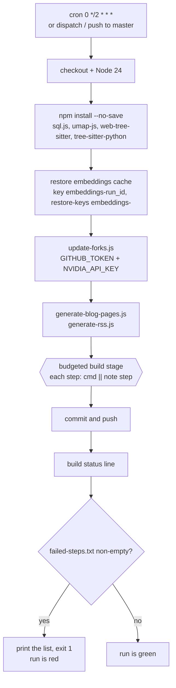
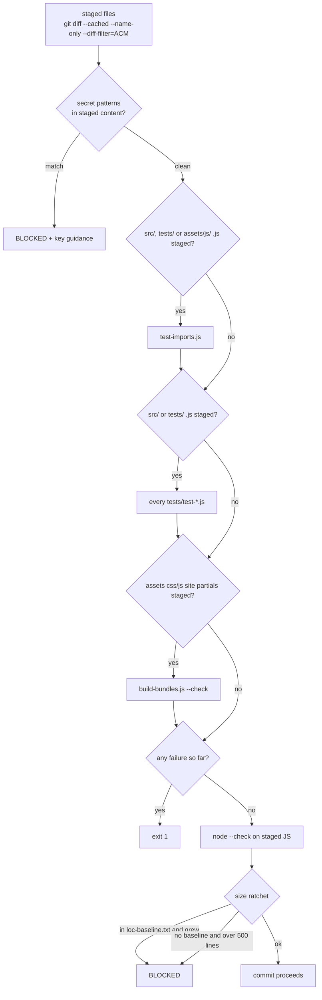

**Status:** DERIVED - every budget, interval and pattern read from the files listed below.
**Sources:** `.github/workflows/update-forks.yml`, `.github/workflows/sync-forks.yml`, `.githooks/pre-commit`, `.githooks/loc-baseline.txt`, `tests/test-*.js`

# Automation and delivery

Glossa has no server. GitHub Actions runs the build on a schedule, the workflow commits
its own output back to `master`, and GitHub Pages serves whatever was committed. There is
no build step between the commit and the published site, which is the single fact that
shapes everything below: anything wrong in the tree is live, and anything not committed
does not exist.

Two workflows run unattended.

| Workflow | Trigger | Cron |
| --- | --- | --- |
| `update-forks.yml` | schedule, `workflow_dispatch`, `repository_dispatch` (`update-forks`), push to `master` touching `src/**/*.js` or `tests/**/*.js` or the workflow itself | `0 */2 * * *` - every two hours |
| `sync-forks.yml` | schedule, `workflow_dispatch` | `0 5 * * *` - daily at 05:00 UTC |

`sync-forks.yml` is the smaller of the two. It fast-forwards every fork to its upstream
through GitHub's merge-upstream API, holds only `contents: read`, and skips a fork whose
upstream was deleted or made private rather than touching it. It needs a
`FORK_SYNC_TOKEN` secret because the default `GITHUB_TOKEN` is scoped to this repository
alone and cannot reach the other forks.

## The scheduled run



The build stage is a single shell step containing eleven commands. Concurrency group
`update-forks` with `cancel-in-progress: true` means a newer run supersedes an older one
rather than two runs racing to commit.

Embeddings are the one artefact that is cached rather than committed: roughly 570 repos at
1024 dimensions is too large for git history and is fully rebuildable, so a cold cache
costs one run's re-embedding and nothing more.

## Budgets

Every stage that talks to the network is budgeted. A run therefore has a bounded cost and a
bounded wall-clock, and a backlog drains across successive cron passes instead of being
cleared in one long, expensive, failure-prone run. The deliberate trade is that the
published state is *eventually consistent*, not transactional: at any given moment some
repositories are analysed and some are not, and the gap closes two hours at a time.

| Stage | Budget | What it bounds |
| --- | --- | --- |
| `build-structure.js` | `--limit 150` | file/folder structures fetched for repos added since the last run |
| `build-analyze.js` | `--all --budget 40 --max-files 2500` | repos deep-analysed per run; per-repo file count, so giants qualify only as `--max-files` is raised over time. Skips repos already analysed |
| `build-stats.js` | none | pure recount of the hero stats |
| `build-deps.js` | `--budget 120 --registry 150` | repos whose manifests are read, and registry resolutions; the comment records a 934-repo backlog draining over time |
| `build-symbols.js` | `--lang all --budget 60 --max-seconds 300` | tree-sitter parsing; wall-clock bounded at roughly 10s per repo, so a 300s slice drains about 30 repos against an 863-repo backlog. Candidates are interleaved by language so no language starves |
| `build-hygiene.js` | `--budget 80 --max-seconds 240` | one tree request per repo plus a bounded number of raw reads |
| `build-osv.js` | `--budget 80 --details 150` | `api.osv.dev` is unauthenticated and batches 100 packages per request, so the estate is about 60 requests; advisory *descriptions* are one request each, hence the separate `--details` budget |
| `build-grade.js` | none | pure join over hygiene, analysis and advisories; must run after all three |
| `build-index.js` | none | read-side build: the lean index, the search index and the sitemap |
| `build-relations.js` | none | reads the index `build-index` just wrote, and writes `llms.txt` |
| `build-banner.js` | none | drawn from `data/index.json`, so it runs after the index rather than redrawing the previous run's estate |

The unbudgeted stages are joins and read-side builds over data already on disk. Their
ordering constraints, not their cost, are why they sit at the end.

## Failure recording, not failure suppression

The build stage defines one function:

```bash
note() { echo "$1" >> "$RUNNER_TEMP/failed-steps.txt"; echo "::error::$1 failed"; }
```

and every command is written `node src/stages/build-x.js ... || note build-x`.

This exists because the whole stage previously ended in `|| true`. A crash in
`build-symbols` was then indistinguishable from a clean pass: the run went green and the
*next* step committed whatever partial state the crash left behind. The workflow's own
comment records that an audit flagged this against the repository as a high finding, and
that it was right to.

The design separates two things that `set -e` conflates. A failing stage must not stop the
remaining stages, because they are largely independent and the backlog should still drain.
But a failing stage must still make the run red, so the failure is visible. `note()` gets
both: the step continues, the failure is appended to `$RUNNER_TEMP/failed-steps.txt` and
annotated with `::error::`, and a final step reads that file and exits 1 if it has any
content.

That final step deliberately runs *after* the commit and push, so a crashed stage still
contributes whatever it produced, and the run still turns red.

## Committing to its own repository

The workflow holds `permissions: contents: write`, configures a `GitHub Action` identity,
stages a fixed list of paths -- `forks.json blog/ feed.xml atom.xml structure/
stats.json data/ sitemap.xml sitemap.html llms.txt` -- discards everything unstaged with
`git checkout -- .`, and commits with `[skip ci]` so the push does not retrigger the
workflow. Because the branch can move under it, it does `git pull --rebase` before
`git push`.

This is the structural consequence worth naming: CI and the developer push to the same
branch. A local commit made while a scheduled run is in flight will conflict or be rebased
over, and generated files are the ones both sides touch. Treat everything in the staged
list as owned by the pipeline, pull before working, and expect the two-hourly run to be a
competing writer rather than a background detail.

## The pre-commit gate

The repository is public and Pages-served, so the local hook is the boundary that matters.
Install it with `git config core.hooksPath .githooks`.



**Secrets.** The scan runs against staged *content* (`git show ":$f"`), not the working
tree, so a key cannot slip in via `git add -p` on a file that looks clean on disk. Binary
and font paths are skipped. The pattern is:

```
nvapi-[A-Za-z0-9_-]{16,}|sk-[A-Za-z0-9]{20,}|ghp_[A-Za-z0-9]{30,}|github_pat_[A-Za-z0-9_]{30,}|AKIA[0-9A-Z]{16}|-----BEGIN [A-Z ]*PRIVATE KEY-----
```

On a match the hook prints its own guidance:

> This repo is public and served by GitHub Pages. Keys belong in
> `~/.nvidia-api-key` and the repository Actions secrets, never here.

That advice is printed *only* for an actual key match. It previously fired for every block,
so a failing unit test was answered with a lecture about API keys.

**Reachable references and unit tests.** `test-imports.js` runs when any `src/`, `tests/` or
`assets/js/` JavaScript is staged, because a file referencing a name it no longer imports
parses and loads fine and fails only on the branch that uses it -- two such references
shipped in a split and surfaced days later when a model timed out in CI. When any
`src/*.js` is staged the hook runs the whole `tests/test-*.js` suite, since it takes
under half a second and being selective buys nothing. The suites are hermetic: eleven files
-- classify, flow, globals, grade, imports, languages, manifest, markdown, quality,
relations, runtime-checks -- each asserting against inline fixtures, with no network calls
anywhere in them. They existed before the hook ran them, which made them documentation
rather than guardrails.

**Bundle freshness.** Editing `assets/css/site/`, `assets/js/site/` or `assets/partials/`
without running `src/site/build-bundles.js` would publish the old stylesheet, because Pages
serves what is committed and no build runs before it. The hook calls
`build-bundles.js --check` and reports the `STALE` lines.

**Size.** `MAX_LINES=500`. Generated and vendored paths are exempt -- `blog/`, `data/`,
`structure/`, `node_modules/`, `Resume/`, `images/`, the top-level generated JSON and XML
files, `assets/css/blog-post.css`, and `assets/css/site.css`, `assets/js/site.js` and
`index.html` as build-bundles output, plus `*.db`, images, `*.min.*` and
`package-lock.json`. Exempting the bundles is precisely why the freshness check above
exists: it catches the failure that actually matters for a committed artefact.

**The ratchet.** A hard cap was unenforceable because twelve files were already over it
when the rule landed. `.githooks/loc-baseline.txt` is a tab-separated `length<TAB>path`
table read by `awk`; a file listed there may shrink but never grow past its recorded
length, while an unlisted file is held to the flat 500. Note that the file is currently
empty -- zero lines -- so nothing is grandfathered at present and every non-exempt file is
held to the flat cap.

The bypass is `git commit --no-verify`, and the hook's header asks that you say so in the
message if you use it.
