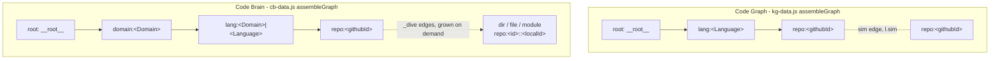
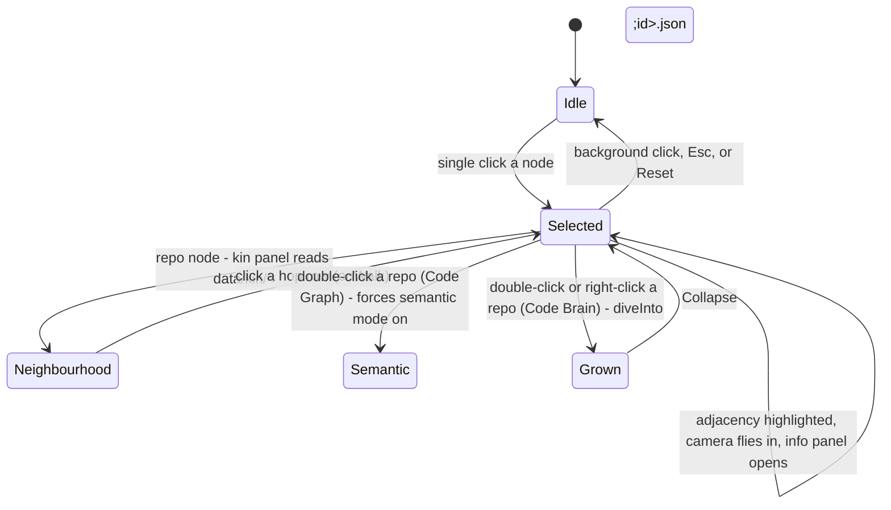

# The graph layer

**Status:** DERIVED - every constant and control read from the files listed below.
**Sources:** `assets/js/graph-shell.js`, `assets/js/knowledge-graph.js`, `assets/js/kg-data.js`, `assets/js/kg-traverse.js`, `assets/js/code-brain.js`, `assets/js/cb-data.js`, `assets/js/cb-dom.js`, `assets/js/cb-panel.js`, `assets/js/graph-grade.js`, `knowledge-graph.html`, `code-brain.html`, `data/kin/1004131322.json`, `data/clusters.json`, `data/grade-map.json`, `forks.json`

## Why there are two graphs

Glossa draws the same estate - 1,440 repositories in `forks.json` - twice, because the two
pages mean different things by "adjacent".

- **Code Graph** (`knowledge-graph.html`) is a map of *meaning*. In semantic mode every
  repository is pinned to its own three-dimensional UMAP coordinate and similarity edges are
  drawn between repositories whose embeddings are close. Distance on screen is distance in
  embedding space.
- **Code Brain** (`code-brain.html`) is a *hierarchy*: owner, then domain, then language, then
  repository - and a repository can be grown open to reveal the files, directories or modules
  inside it. Nothing is positioned by meaning here; the force layout settles the tree.

One page cannot be both. Code Graph answers "what else is like this", Code Brain answers "what
is this made of", and the two questions want opposite layouts.

## What the shared module holds, and why it is small

`graph-shell.js` opens with the reasoning for its own size:

> Code Brain and Code Graph render the same library over the same node kinds with the same
> chrome, and were built from a common ancestor. The honest finding after comparing them
> function by function is that most of the divergence is real: their `build()` bodies differ by
> 2,500 characters because one dives into files and modules and the other lays repositories out
> by meaning, and `computeHighlight` differs because the two graphs mean different things by
> "adjacent". Forcing those into one function behind a config object would produce something
> harder to read than the two it replaced.

> What is genuinely common is the mechanical part: sizing the canvas to its container, and
> moving the camera to a node. Both were copied verbatim, and the canvas one was copied along
> with the bug comment explaining why it exists.

So the shell exports exactly `fitToContainer`, `flyTo` and `initRailToggle`, plus a
self-starting `syncNavHeight`. The behaviour the two pages genuinely share beyond that lives in
its own modules instead: `graph-grade.js` and `kg-traverse.js`.

### Canvas sizing

`fitToContainer` drives the canvas from its container, not the window, and carries the bug that
forced it:

> force-graph sizes itself from the window, but the canvas lives in a grid cell narrower than
> the viewport. Left alone the canvas was 1440x757 inside a 1060x701 box, so every pointer
> coordinate was offset: clicks selected the wrong node and zoom felt wrong. Drive the size from
> the container instead, and keep it in step as the container changes.

A `ResizeObserver` on the stage keeps it in step, which is also why collapsing the rail needs no
explicit resize call: changing the grid track fires that observer.

## The node and edge model

Node kinds by page:

| kind | Code Graph | Code Brain | id form |
| --- | --- | --- | --- |
| `root` | yes, `val` 46 | yes, `val` 50 | `__root__` |
| `domain` | no | yes, `val` 26 | `domain:<name>` |
| `lang` | yes, `val` 16 | yes, `val` 13 | `lang:<lang>` / `lang:<domain>\|<lang>` |
| `repo` | yes | yes | `repo:<githubId>` |
| `dir`, `file`, `module` | no | only after a dive | `repo:<id>::<localId>` |

Repository node ids are `repo:<githubId>` on **both** pages. That is what lets one kin file
resolve identically on either: `kg-traverse.js` strips the `repo:` prefix to fetch
`data/kin/<id>.json`, and re-adds it (`ctx.nodeById['repo:' + s.id]`) to find the hop target.
`graph-grade.js` strips the same prefix to look a repository up in the grade map.

Edge kinds:

- **Structural** - root to language to repository, and on Code Brain root to domain to language
  to repository. Always present, always in `links`.
- **Similarity** (`kind: 'sim'`, Code Graph only) - built from `data.similarityLinks`, kept
  *out* of `links` so the default force view stays structural, and swapped in when semantic mode
  turns on.
- **Dive** (`_dive: true`, Code Brain only) - imports between modules, or containment between
  directories and files, read from `structure/<id>.deep.json` with `structure/<id>.json` as the
  fallback file tree. Nodes with no incoming internal edge are wired to the repository node, so
  the structure sprouts outward from it.

## Edge strength, and why 0.68

Verified: `forks.json` holds **1,440** repositories and **3,444** similarity links. Drawing all
3,444 over 1,440 nodes is a hairball, so the slider in `knowledge-graph.html` (`#edge-min`,
`min="0.40" max="0.95" step="0.01" value="0.68"`) hides the weak ones, and the readout says
"N of 3444 edges drawn".

The default is not a taste judgement. `kg-traverse.js` sets `CLUSTER_AT = 0.68` and initialises
the control at that value; `data/clusters.json` records `"threshold": 0.68`, method "Louvain
modularity over the thresholded semantic edges", producing 61 clusters. The module says why they
must agree:

> the default is the value `data/clusters.json` groups at, so what the page draws and what the
> layer clusters on are the same graph. Anything else and the picture quietly argues with the
> data.

The control is hidden outside semantic mode, "where there are no similarity edges for it to act
on and it would only invite a drag that does nothing."

## Interaction: select, inspect, walk

A single click focuses: highlight the node and its adjacency, fly the camera to it
(`GraphShell.flyTo`, padding 120 for a repository and 220 otherwise on Code Graph; 150 for a
repository, 260 for a domain, 120 otherwise on Code Brain), open the info panel, and sync the
rail deck. Auto-rotate stops the moment the user touches the controls.

Double-click has no hook in force-graph, so both pages pair clicks by time with the same 400 ms
window. What the second click *means* differs:

- Code Graph: re-focus, and if the node is a repository and semantic mode is off, turn it on -
  the gesture reads as "show me this one in meaning-space".
- Code Brain: re-focus and `diveInto(node)` - grow the repository's internals. Right-click does
  the same thing in one gesture.

Growing pins every node that already has a position first, because "re-supplying graphData
reheats the whole simulation, so growing one repo re-laid-out all 1296 of them and the estate
appeared to explode." Module graphs are recoloured by detected community (label propagation);
file and directory trees keep their language and kind colours.

## Walking to a neighbour

Two different walks exist.

`Prev` / `Next` and the arrow keys (Code Graph only) step through `adjacency[focusId]`. Semantic
mode rebuilds adjacency from `links` concatenated with the visible similarity edges, so "Next"
walks semantic kin in semantic mode and same-language siblings otherwise. Each step makes the
neighbour the new focus, so walking compounds.

The kin panel is the other walk, and it is the shared one. `KGTraverse.render` fetches
`data/kin/<id>.json` - roughly 1 KB per repository, the same files `llms.txt` advertises - and
renders two provenance-tagged lists from it: `stack` (tagged **extracted**, scored by IDF-weighted
package overlap, with up to three shared package names printed as evidence) and `semantic`
(tagged **inferred**, scored by cosine similarity, with no evidence line at all). Each list shows
at most `MAX_ROWS = 6` rows, and the cluster id appears as a heading when the file carries one.
Extracted is printed first, because "putting the guess above the measurement would be the wrong
order to read them in", and a neighbour appearing on both lists gets a `both` tag - an inferred
edge corroborated by an extracted one being the strongest thing the data holds.

Every row is a button, and clicking it hops. A hop can name a repository the graph does not
hold, since the relation layer is built from a later pipeline stage than `forks.json`; both pages
guard for that rather than navigating to nothing. Where no kin file exists, Code Graph falls back
to its own `simByRepo` index (top 4, labelled `inferred` all the same, because "an unlabelled
list next to a labelled one reads as measured"). Code Brain passes no `simByRepo` - it draws no
similarity edges - and the module was made to tolerate that after "reading it unguarded made a
module written to be reusable throw for its second caller". With neither source the panel says
"No published neighbourhood yet", because an empty panel would read as "nothing is like this",
and those are different answers.

A `kinToken` counter on both pages discards a slow fetch that resolves after the panel has moved
on to another node.

## Grade as a colour channel

`graph-grade.js` fetches `data/grade-map.json` on first press of `#grade-toggle`, not at load,
because "most visits never ask this question, and 37 KB is not worth spending on the ones that do
not." Grade *replaces* the base colour rather than joining it - language on Code Graph, domain on
Code Brain - since two colour meanings on one node is no meaning at all.

The scale is banded, not continuous, because "a continuous scale invites reading a two-point
difference as meaningful, and the grade is not that precise":

| score at least | letters | colour |
| --- | --- | --- |
| 80 | A / B+ | `#3FB27F` |
| 70 | B | `#7FB069` |
| 60 | C+ / C | `#D9A441` |
| 50 | C- | `#D97D3F` |
| 0 | D / F | `#C4503A` |

Two values sit outside that scale. `UNGRADED = '#4A4741'` - a hollow grey - is for a repository
with no entry in the map, because "any position on a green-to-red ramp is a claim about quality
that nothing measured supports". An unaudited repository is not a bad one; it is given no
position on the ramp at all. `NON_REPO = 'rgba(120,130,160,0.10)'` covers every node that is not
a repository: root, domain, language, and all dive nodes. A partial grade (the third field of a
map entry) keeps its band colour and fades 45% toward `0x2A`, the page background, so it reads as
the same colour seen through less evidence rather than as a different colour. The legend renders
the five bands plus both exceptions - "the legend has to carry the two exceptions, not just the
ramp, because the ramp is the part a reader can already guess."

## Controls

| control | Code Graph | Code Brain |
| --- | --- | --- |
| Search (Enter) | repo substring, then any node | repo substring only, toast on miss |
| Reset | clears search, camera to z=900, resumes auto-rotate | also clears filters, collapses dives, unpins, camera to z=1000 |
| Semantic map toggle | yes; disabled when embeddings are absent | no |
| Edge-strength slider | yes; shown only in semantic mode | no |
| Domain / size filters | no | yes: `<= 20`, `21-100`, `> 100` files |
| Grade toggle | yes, restores the language legend | yes, restores the domain legend |
| Legend toggle | "Hide languages" | "Hide key" |
| Deck | flat repo cards, stars-sorted, 120 per page | drill-down: domain, then language, then repo |
| Info panel | close, collapse, kin, Prev / Next | close, collapse, kin, Grow / Collapse, report |
| Dock collapse | no | yes |
| Rail collapse | yes, shared, remembered in `localStorage` | yes, the same |

## Note on drift

`graph-grade.js`'s header comment describes an estate of 1,433 repositories with 1,432 graded and
one unaudited. `data/grade-map.json` currently reports `graded: 1439` with a mean of 60.5,
against 1,440 repositories in `forks.json`; `code-brain.js` likewise mentions 1,296 and
`kg-data.js` 1,295. These are prose in comments, not constants the code reads, so nothing behaves
wrongly - but the figures in them are stale and should not be quoted as current.
