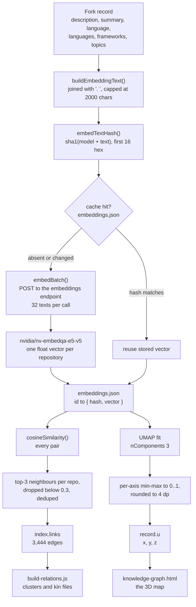
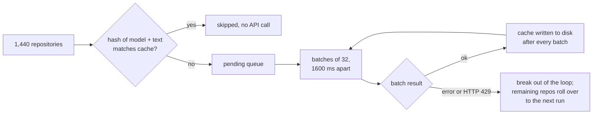

# 10 — Embeddings: the vector pipeline

**Status:** DERIVED - every parameter read from the files listed below.
**Sources:** `scripts/lib-embeddings.js`, `scripts/build-relations.js`, `scripts/lib-relations.js`, `scripts/lib-config.js`, `package.json`, `.gitignore`, `.github/workflows/update-forks.yml`, `data/index.json`, `data/schema.json`

Glossa analyses 1,440 public repositories (`data/index.json`, `total: 1440`). The embedding
subsystem answers one question and only one: **where does this repository sit relative to the
others?** It produces the map. It never produces the grade.

## Why embeddings are kept out of the grading path

A grade has to be defensible. Every category in the eight-category grade is EXTRACTED — measured
from a tree, a history or a manifest, and reproducible from the same inputs by anyone with the
same repository. A cosine score is not like that. `data/relations.json` states the difference in
the pipeline's own words: the semantic edge type records `evidence: 'none beyond the similarity
score itself'`, while the stack edge type names the packages it was drawn from.

A dependency edge can be argued with — you open both manifests and check. A cosine of 0.71 cannot
be checked; it is a number that fell out of a neural network reading a text that itself contains a
generated summary. Let that number touch a score and the score inherits its unfalsifiability. So
the vectors are allowed to move a repository around the map and to nominate neighbours, and
nothing else. `data/schema.json` marks the projected coordinate `u` as "INFERRED, not measured:
the only field in a record that a model produced."

## The pipeline



## What text is embedded

`buildEmbeddingText()` in `scripts/lib-embeddings.js` assembles, in order and only where present:
the repository description; the generated summary passed through `stripMarkdown()` and truncated
to 500 characters; `Primary language: <language>`; `Languages:` followed by the keys of
`knowledgeGraph.languages`; `Frameworks:` followed by `knowledgeGraph.frameworks`; and `Topics:`
followed by `topics`. The parts are joined with `'. '` and the whole string is sliced to 2,000
characters. No file contents, no source code, no README body beyond what the summary already
carried.

Note what this means: the input to the embedding already contains a model-generated summary. That
is the second reason the output cannot be treated as measurement — the provenance of the input is
inferred before the embedding model ever sees it.

## Parameters

| Parameter | Value | Source | Notes |
|---|---|---|---|
| Embedding model | `nvidia/nv-embedqa-e5-v5` | `lib-embeddings.js`, `lib-config.js` | overridable via `EMBED_MODEL`; the workflow pins the same default |
| Endpoint | `${LLM_BASE}/embeddings` | `lib-embeddings.js` | `LLM_BASE` derives from `LLM_ENDPOINT`, default `https://integrate.api.nvidia.com/v1` |
| Input vector dimensionality | 1024 | `.gitignore`, `update-forks.yml` comments | documented, not asserted in code — see below |
| `input_type` | `passage` | `EMBED_INPUT_TYPE` default | probed: on HTTP 400 mentioning `input_type`, retried once without it |
| `encoding_format` | `float` | `embedBatch()` | |
| `truncate` | `END` | `embedBatch()` | server-side truncation of over-long input |
| `EMBED_BATCH` | 32 | `lib-embeddings.js` | texts per request |
| `EMBED_DELAY` | 1600 ms | `lib-embeddings.js` | "Account rate limit is 40 rpm, so requests must be spaced past 1500ms." |
| Cache file | `embeddings.json` | `EMBED_CACHE_FILE` | keyed by fork id, storing `{ hash, vector }` |
| `EMBED_DIMS` | 3 | `lib-embeddings.js` | UMAP output dimensions; the graph is 3D, not 2D |
| UMAP `nNeighbors` | `max(2, min(15, n - 1))` | `computeUmapAndKnn()` | |
| UMAP `minDist` | 0.1 | `computeUmapAndKnn()` | |
| UMAP minimum corpus | 5 vectors | `computeUmapAndKnn()` | below this, projection is skipped entirely |
| `KNN_K` | 3 | `lib-embeddings.js` | neighbours considered per repository |
| `KNN_MIN_SIM` | 0.3 | `lib-embeddings.js` | candidate edges below this are not emitted |
| `CLUSTER_AT` | 0.68 | `lib-relations.js` | "the threshold the graph already treats as kin" |
| `KIN_LIMIT` | 12 | `lib-relations.js` | neighbours written per repository, per edge type |
| `umap-js` | `^1.4.0` | `package.json` | the only dependency this subsystem needs |

On dimensionality: the code never hard-codes 1024. `computeUmapAndKnn()` reads `vectors[0].length`
at runtime and counts how many vectors disagree with it, refusing to project a ragged matrix
because "a model switch mid-cache can cause it". The figure of 1024 appears in two comments —
`.gitignore` and the workflow — as the width of `nvidia/nv-embedqa-e5-v5`. It is documented rather
than enforced, and it cannot be verified from this repository, because the vectors themselves are
not committed.

## Where the vectors live, and why not in git

`embeddings.json` is listed in `.gitignore`, with the reason stated inline:

> `# Embedding vectors: ~570 repos x 1024 dims is multi-MB and changes most runs, so`
> `# it lives in the Actions cache instead of git history. Rebuildable from the API.`

`.github/workflows/update-forks.yml` restores it before the run:

```yaml
- name: Restore embeddings cache
  uses: actions/cache@v6
  with:
    path: embeddings.json
    key: embeddings-${{ github.run_id }}
    restore-keys: |
      embeddings-
```

The key is unique per run, so every run writes a fresh entry; the `restore-keys` prefix means each
run restores the most recent previous one. The workflow comment states the failure mode plainly:
"A cold cache just means one run pays to re-embed." Nothing is lost when the cache is evicted —
only time and quota.

Three properties make this the right call rather than a shortcut. The file is multi-megabyte. Its
content changes on most runs, so committing it would push a large blob into history repeatedly and
permanently. And it is fully derivable from the API given the same inputs, so history buys nothing
that a rebuild does not.

The 570 in that comment is the estate size at the time it was written; the estate is now 1,440
repositories, so the argument has only got stronger.

## How cost is bounded



Four mechanisms, all in `generateEmbeddings()`:

1. **Content hashing.** The cache key is a SHA-1 of the model name and the text, truncated to 16
   hex characters. A repository whose description, topics, languages and summary are unchanged is
   not re-embedded. Changing `EMBED_MODEL` invalidates every entry, deliberately — the model name
   is inside the hash.
2. **Batching.** 32 texts per request, so a full cold rebuild of 1,440 repositories is roughly 45
   requests rather than 1,440.
3. **Spacing.** 1,600 ms between batches, sized against a stated 40 requests-per-minute account
   limit.
4. **Fail-fast with roll-over.** Any batch error breaks the loop rather than retrying the rest:
   "Give up on the rest of the run rather than burning quota on a systemic failure." Whatever
   landed in the cache is saved and reused next run. HTTP 429 is called out specifically — the
   remaining repositories simply wait for the next scheduled run. The only retry in the whole
   subsystem is the one-shot `input_type` probe, which is a compatibility check rather than error
   recovery.

If no API key is present, `generateEmbeddings()` logs and returns immediately with zero embedded.
The map degrades; nothing else breaks.

## The API key

The key is read as `process.env.NVIDIA_API_KEY || process.env.LLM_API_KEY`, in both
`lib-config.js` and `lib-embeddings.js` — duplicated on purpose, since threading it through would
make every caller carry configuration it has no other use for. In CI it is supplied from repository
secrets and used only as a bearer token on the outbound request.

This repository is public. The key must never appear in a file, a commit, a log line or a data
artefact. Nothing in this subsystem writes it anywhere: `embeddings.json` holds only hashes and
vectors, and the batch error path truncates the response body to 300 characters before logging it.

## From vectors to coordinates

After embedding, `computeUmapAndKnn()` filters to repositories that actually hold a vector,
requires at least five of them, and requires a uniform width. It then fits `umap-js` with
`nComponents: 3`, `nNeighbors: max(2, min(15, n-1))` and `minDist: 0.1`.

Raw UMAP output is unbounded and its scale varies from run to run, so each axis is normalised
independently to `[0, 1]` against that run's own minimum and maximum, then rounded to four decimal
places. That is what lands in the `u` field of each index record, and it is why the front end can
scale the map to any box size without knowing anything about the embedding.

Verified against `data/index.json`: 1,407 of 1,440 records carry `u`; every one is an array of
exactly three numbers; the observed range across all three axes is exactly `[0, 1]` inclusive, as
min-max normalisation requires. A representative value is `[0.5271, 0.1557, 0.7159]`.

The 33 records without `u` are repositories with no vector — never embedded, or embedded after the
last projection ran. Their absence is the honest representation: no coordinate at all, rather than
a default one at the origin that would read as a real position.

Similarity edges are computed in the same pass. For each repository, cosine against every other,
sorted descending, the top `KNN_K` = 3 taken, anything below `KNN_MIN_SIM` = 0.3 discarded, and
each pair keyed order-independently so an edge appears once regardless of direction. Similarity is
rounded to three decimal places. `data/index.json` carries 3,444 such edges as
`[sourceId, targetId, similarity]` triples, with observed similarity running from 0.395 to 0.849 —
consistent with the 0.3 floor, and an indication that nothing in this estate is a near-perfect
semantic duplicate.

Downstream, `build-relations.js` reads those edges and nothing else from this subsystem. It
thresholds them at `CLUSTER_AT` = 0.68, and writes per-repository neighbourhood files that restate
the provenance in every single one of them:

```json
"provenance": { "semantic": "INFERRED", "stack": "EXTRACTED" }
```

That repetition is the point. A reader who fetches a single 1 KB kin file and nothing else still
learns which half of it was measured and which half is a guess.
