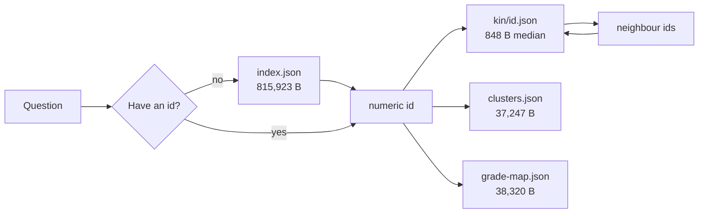

# 11. The agent interface

**Status:** DERIVED - every size and record key measured from the published files.
**Sources:** `llms.txt`, `data/schema.json`, `scripts/lib-schema.js`, `scripts/build-index.js`, `scripts/test-relations.js`, `data/relations.json`, `data/index.json`, `data/search.json`, `data/clusters.json`, `data/clusters.md`, `data/grade-map.json`, `data/kin/1004131322.json`, `data/kin/1324517271.json`, `.claude/skills/query-repo-estate/SKILL.md`, `.claude/skills/query-repo-estate/estate.mjs`

Glossa publishes its analysis of the estate as static files whose *shape* is the
query interface. There is no API and no server. Every read below is a plain GET
against GitHub Pages. This page traces the query paths end to end and prices them.

## The entry point

`llms.txt` is generated, not hand-written, and it carries a numbered protocol.
Verbatim, under the heading "Answering a question with these files":

> 1. Resolve a repository to its numeric id once, from /data/index.json or /data/search.json. Ids are stable across renames.
> 2. Fetch https://moses-y.github.io/data/kin/&lt;id&gt;.json, about 1 KB. It carries both edge types with their provenance, so "what else is like this" costs one small request rather than a parse of the 797 KB index.
> 3. Repeat step 2 for any neighbour id. Traversal never needs the index again.
> 4. For a group rather than a neighbour, /data/clusters.json names the keeper; /data/clusters.md is the same thing as prose.

And the selection rule that follows it:

> Prefer a neighbour that appears in both the stack and semantic lists of a kin file: the extracted edge corroborates the inferred one, which is the strongest signal here that a repository is a usable starting point.

Step by step:

**Step 1 is the only expensive step, and it is paid once.** Names are unstable;
GitHub ids are not. Anything that resolves a name pays for `index.json`
(815,923 bytes measured, 796.8 KiB, 188,955 bytes gzipped). Everything after that
works in integers.

**Step 2 is the design.** `data/kin/<id>.json` is a pre-materialised answer to
"what is like this?", holding both edge types with their provenance stamped into
the record.

**Step 3 is the payoff.** Every id inside a kin file is itself a kin URL, so a
walk of depth *n* is *n* small GETs and never touches the index again.

**Step 4 is the group question**, which is a different question and has its own
file: `clusters.json` for records, `clusters.md` for the same 61 groups as prose.

## Record encoding

Records use single-letter keys. `scripts/lib-schema.js` declares them in a
`RECORD` map and `describe()` emits `data/schema.json` from that same map, so the
key list and its documentation cannot drift; `build-index.js` writes the schema
next to the index it describes, in the same function that writes the index.

| Key | Type | Meaning (from `lib-schema.js`) |
|---|---|---|
| `i` | integer | GitHub repository id; the join key for every other file in `data/` |
| `n` | string | Repository slug; also the article path `/blog/<n>.html` |
| `t` | string | Display title, falling back to the slug |
| `d` | string | Description, truncated to 180 characters |
| `l` | string\|null | Primary language, from the file census, not the GitHub API |
| `g` | string | Domain, recomputed at index time from language and file census |
| `k` | string\|null | Repository kind, used for grading profiles |
| `s`, `y`, `f`, `x`, `a` | integer / 0\|1 | Stars; original-vs-fork; file count; structural issues; briefing exists |
| `c` | string | Five capability bits: hasTests, hasCI, hasDocker, hasLicense, committedSecrets |
| `v` | int[4] \| 0 \| absent | Findings `[critical, high, medium, low]`; `0` clean; **absent means not audited** |
| `m`, `r`, `z`, `p` | optional | Card image; read time; formatted last-update; fork parent |
| `u` | number[3] \| absent | UMAP projection of the embedding - the one INFERRED field in a record |

`search.json` is a separate encoding: `{"n": 1440, "t": {token: [positions]}}` -
an inverted index of 4,969 tokens, built in `build-index.js` from `n`, `t`, `d`,
`l`, `k`, `g`, with tokens appearing in more than 40 per cent of records dropped
as too common to narrow anything.

## Query paths and their real cost

Every size below is measured on the published file in this checkout.

| Query | File(s) fetched | Bytes | Gzipped |
|---|---|---|---|
| What do these keys mean? | `data/schema.json` | 7,401 | 2,530 |
| How should I traverse this? | `llms.txt` | 5,536 | 2,288 |
| What are the edge types and thresholds? | `data/relations.json` | 1,689 | 794 |
| Which repositories mention X? (`find`) | `data/index.json` | 815,923 | 188,955 |
| Every fact about one repository (`show`) | `index.json` + `schema.json` | 823,324 | - |
| **What is like this, by id (`kin`)** | `data/kin/<id>.json` | **median 848**; mean 1,267; range 408-5,661 | 1,070 for the 3,955-byte sample |
| What is like this, by *name* | `index.json` + one kin file | 816,771 | - |
| Which group, which keeper (`cluster`) | `data/clusters.json` | 37,247 | 6,279 |
| All 61 groups as prose (`report`) | `data/clusters.md` | 32,939 | 5,156 |
| One grade number per repository | `data/grade-map.json` | 38,320 | 11,002 |
| Token to record position | `data/search.json` | 141,974 | 54,097 |

The whole `data/kin/` tree is 1,805,315 bytes across 1,425 files - larger than
the index it replaces, which is the trade: disk on a static host is free, a
client's parse is not.

## The measured argument

Answering "what is like this repository?" from the raw index costs a
**815,923-byte** fetch and parse. From the materialised neighbourhood it costs
**848 bytes** at the median - a ratio of roughly 960 to 1, and the small file is
the *better* answer, because it carries both edge types, their provenance tags,
and the shared package names behind each stack edge, none of which the index
holds. The index carries semantic `links` only.

The principle generalises: **materialise the conclusion, not the edges.**
`grade-map.json` is the same move (38,320 bytes of `id -> [score, letter,
partial]` in place of the full grade records and their reasoning), and
`clusters.md` is the move applied to prose.

```mermaid
sequenceDiagram
    autonumber
    participant A as Agent
    participant P as GitHub Pages (static)
    A->>P: GET /llms.txt
    P-->>A: 5,536 B - protocol and file list
    A->>P: GET /data/schema.json
    P-->>A: 7,401 B - single-letter keys decoded
    Note over A,P: Step 1 - pay for the index once, to get an id
    A->>P: GET /data/index.json
    P-->>A: 815,923 B - 1,440 records, 3,444 semantic edges
    Note over A: openwiki maps to 1324517271. Ids are stable; keep it.
    Note over A,P: Steps 2-3 - traverse in ids, never touch the index again
    A->>P: GET /data/kin/1324517271.json
    P-->>A: 1,668 B - stack and semantic neighbours, provenance tagged
    A->>P: GET /data/kin/{neighbour}.json
    P-->>A: about 848 B - next hop
    Note over A,P: Step 4 - the group question is a different file
    A->>P: GET /data/clusters.json
    P-->>A: 37,247 B - 61 groups, keeper named per group
```



## The shipped CLI

`.claude/skills/query-repo-estate/estate.mjs` is a convenience over the same
HTTP, with no dependencies beyond Node 18 for global `fetch`. Five commands:

| Command | Fetches | Notes |
|---|---|---|
| `find <text>` | `index.json` | Substring scan over `n`, `t`, `d`. It does **not** use `search.json`. |
| `show <id\|name>` | `index.json` + `schema.json` | Prints each key with the schema's own description as the label |
| `kin <id>` | `kin/<id>.json` | One fetch; prints both lists and a `CORROBORATED` line for ids on both |
| `kin <name>` | `index.json` + `kin/<id>.json` | Pays for the index purely to resolve the name |
| `cluster <id\|name>` | `clusters.json` | Names the keeper; prints the clustering method from the file, not a constant |
| `report` | `clusters.md` | The prose form |

`--local` reads `./data` from a checkout; `ESTATE_SITE` retargets the host. Two
choices matter. The tool decodes records using the *fetched* `schema.json` rather
than a private copy of the mapping, so if the published schema ever stops being
sufficient to read the index, this tool breaks first - which is the point. And a
numeric argument short-circuits `resolve()` entirely, so `kin 1324517271` never
opens the index while `kin openwiki` must.

`scripts/test-relations.js` treats the skill as a consumer that lives outside
`scripts/` and would otherwise break silently. Under the heading "the skill can
still read the files it ships against" it executes `estate.mjs ... --local`
against the built data and asserts on the *output*, not the exit code, because
the failure it was written for was reading `sim` where the kin files write
`similarity` - a clean exit and a column of `undefined`. It checks that both
provenance levels print, that no `undefined` appears, that the cluster method
comes from the file, that a cluster is never called a set of duplicates, that
single-letter keys decode into schema descriptions, and that an unknown
repository exits 1 rather than returning an empty answer.

## What this trade costs

No server means no auth, no per-consumer rate limit, no key to leak, no uptime to
own and nothing to operate. It also means, honestly:

- **No query language.** You cannot ask for "Python repositories graded above 70
  with no CI". You fetch a file and filter client-side, which means the 796 KiB
  parse for anything the file layout did not anticipate. The materialised files
  answer the questions someone decided in advance were worth materialising.
- **No server-side joins.** Cross-file questions - grade plus dependencies plus
  hygiene - are the client's problem, and cost the sum of the files.
- **No `/data/kin/` listing.** GitHub Pages serves no directory index, so
  neighbourhoods cannot be enumerated; you must already hold an id.
- **`search.json` maps tokens to *positions* in the `repos` array, not to ids.**
  Step 1 of the protocol offers it as an alternative to the index, but turning a
  position into an id still requires the index. As a standalone name-to-id
  resolver it is incomplete, and `estate.mjs` does not use it at all.
- **Coverage is not total.** 1,425 kin files against 1,440 repositories; stack
  edges exist only for the 397 repositories declaring dependencies in a manifest
  the pipeline reads, of which 350 have edges above the 0.12 threshold.
- **No freshness signal beyond HTTP.** The site is rebuilt nightly, so ids are
  stable but grades, clusters and counts move, and cluster ids are positional and
  will renumber. A cached answer ages silently.
- **Hand-written documentation drifts against the data.** `SKILL.md` quotes the
  index at 774 KB and `llms.txt` at 797 KB; the measured file is 796.8 KiB.
  `llms.txt` and `schema.json` are generated and track the build; `SKILL.md` is
  not and does not.

The compensation is that every one of these files is a URL a crawler, a script or
an agent can take without negotiation, and the cheap path - resolve once, then
traverse in ids - is written into the file such a reader opens first.
