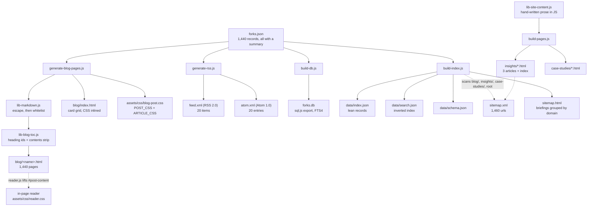

**Status:** DERIVED - every path and count measured from the repository.
**Sources:** `scripts/generate-blog-pages.js`, `scripts/generate-rss.js`, `scripts/build-db.js`, `scripts/build-index.js`, `scripts/build-pages.js`, `scripts/lib-markdown.js`, `scripts/test-markdown.js`, `scripts/lib-blog-css.js`, `scripts/lib-blog-css-article.js`, `scripts/lib-blog-index-css.js`, `scripts/lib-blog-analysis.js`, `scripts/lib-blog-toc.js`, `scripts/lib-site-content.js`, `.githooks/pre-commit`, `.githooks/README.md`, `forks.json`, `blog/`, `insights/`, `assets/css/reader.css`, `assets/css/report.css`, `report.html`, `assets/js/reader.js`, `sitemap.xml`, `feed.xml`, `atom.xml`

# 12 - Publishing

This document covers what happens to a briefing *after* it exists as stored
text. How the prose is written is out of scope; so is the home page bundle.

## The one source of truth

Everything published starts from a single file, `forks.json`, at the repository
root. Measured: 1,440 repository records, of which 1,440 carry a `summary`
field. Each publishing script re-reads that file independently and each exits
with an error if it is missing - there is no shared build orchestrator, only a
convention that `update-forks.js` runs first.

## Why the pages are pre-generated

The site is served by GitHub Pages: static files, no server, no build step at
request time. Client-side rendering would mean every visitor downloading the
article store before seeing a word. `build-index.js` records the size of that
store in its own header comment - `forks.json` is measured there at 10.3 MB, of
which 44% is article prose - and `forks.db` is 20.8 MB on disk as measured
today. Pre-rendering moves that cost to build time and leaves each reader with
one small HTML file.

The second reason is discovery. A crawler will not execute a fetch-and-render
path to find 1,440 articles. `sitemap.xml` currently lists 1,460 URLs, of which
1,440 are `blog/*.html`; a client-rendered site would have listed the shell.

## From stored prose to a page

`generate-blog-pages.js` filters `forks.json` to records with a `summary`, and
for each writes `blog/<name>.html`. The body is assembled by `renderSummary`
(`lib-blog-analysis.js`) then `annotate` (`lib-blog-toc.js`):

- `hasStrongStructure` (headings or a fence) sends the whole text through
  `renderMarkdown`.
- Otherwise the text is split into blocks and only blocks that `hasMarkdown`
  reports on are rendered as markdown. This exists because articles stored
  before the renderer landed were flattened at write time; the source comments
  name 1,331 such articles.
- `annotate` assigns an id to every heading (lowercased, non-alphanumerics
  collapsed to `-`, trimmed, truncated to 48 characters, de-duplicated with a
  numeric suffix) and emits a contents strip when there are at least 4 sections.

The generated page (verified against `blog/4gaBoards.html`, 320 lines) carries:
Open Graph and Twitter card metadata, a canonical link, three external
stylesheets (`tokens.css`, `blog-post.css`, `report.css`), a mermaid CDN script,
a header with a back link and theme toggle, a metadata row, an abstract, a
speech-synthesis "listen" bar, `#post-content`, the analysis section, the audit
section rendered in `report.css`'s `.rpt` namespace, topic tags, and inline
scripts for theme and mermaid.

`#post-content` is the reuse seam: `assets/js/reader.js` fetches the generated
page, parses it, and lifts that element into an in-page modal styled by
`assets/css/reader.css`. The reader therefore inherits the markdown rendering
without a second implementation.

## Slugging: there is no slugging

This is the nuance most likely to be assumed wrongly. The generator writes
`${post.name}.html` - the GitHub repository name, unchanged. No lowercasing, no
transliteration, no character stripping. The same raw name is used for the
canonical URL, `og:url`, the RSS `<link>` and `<guid>`, and the Atom `<id>`.

Measured over all 1,440 names: **0** contain a character outside
`[A-Za-z0-9._-]`, and there are **0** case-insensitive collisions. This holds
because GitHub itself restricts repository names to that set, so the identity
mapping is safe by construction rather than by design. Two edge cases are real:

- 1 name begins with a dash (`-RohanKar-Launcher`), producing
  `blog/-RohanKar-Launcher.html`.
- 13 names contain a dot (`h3.c`, `term.everything`, `remoto.el`,
  `learn-anything.xyz`, `trigger.dev` and eight others), producing filenames
  with two extension-like segments.

Neither breaks under GitHub Pages, but note the inconsistency: `build-index.js`
and `reader.js` wrap the name in `encodeURIComponent` when linking, while the
generator and both feeds emit it raw. For the current name set the two forms
are identical, so the divergence is latent rather than active. Case sensitivity
is the live risk if the site is ever served from a case-insensitive filesystem;
today there are no colliding pairs.

## Markdown as a security boundary

The input to `renderMarkdown` is model output published on a public domain, so
the renderer is the sanitiser. Its design is stated in `lib-markdown.js` and is
order-dependent: `escapeHtml` runs once over the entire input (`&`, `<`, `>`)
*before* any rule fires, and only then is a fixed whitelist of transformations
applied. Nothing in the source can produce a live tag, because there are no
angle brackets left to close one with. Images are dropped to their caption text;
links are honoured only if the URL matches `^(https?://|mailto:|/|#)`; fenced
code is emitted verbatim and never passed back through the inline pass.

`test-markdown.js` runs 33 assertions. The refusal set, reported exactly:

| Input | What is asserted |
| --- | --- |
| `` | output does not contain `<script` |
| `` | output does not contain `hi
` | no `<div` element; `&lt;div` present instead |
| `[click](javascript:alert(1))` | no `href` at all, label survives |
| `[x](data:text/html;base64,...)` | no `href` |
| `[docs](https://example.com/a)` | href is allowed |
| HTML inside a code fence | still inert |
| `` | no `` but not `"` or `'`, and the
   captured URL goes straight into `href="${url}"`. A URL that satisfies
   `SAFE_URL` and contains a raw double quote would close the attribute early.
   No test covers this case. It cannot introduce a new element, but it can
   introduce an attribute on an existing anchor.
2. The tests assert on substrings rather than on a parse of the output, so they
   verify the absence of specific known payloads rather than a general
   invariant.

## Feeds

`generate-rss.js` sorts posts by `updatedAt || forkedAt` descending, takes the
**20 most recent**, and writes both `feed.xml` (RSS 2.0) and `atom.xml`
(Atom 1.0). Measured: 20 `<item>` elements and 20 `<entry>` elements. Item
descriptions are the raw stored summary truncated to 500 characters with an
ellipsis - markdown is *not* rendered for the feed, only XML-escaped. Language
and topics become `<category>` entries.

## The database

`build-db.js` builds an in-memory SQLite database with `sql.js` and exports it
to `forks.db` (20.8 MB measured). Tables: `meta`, `repos`, `topics`,
`knowledge_graphs`, plus an FTS4 virtual table `repos_fts` over name, display
name, description and summary, and five indexes. Its purpose is queryable
offline access to the whole estate. It is explicitly *not* the search path for
the site: `build-index.js` exists precisely because listing pages were
downloading both `forks.json` and this file.

## Index, search and sitemap

`build-index.js` is the read side. It writes:

- `data/index.json` (816 KB measured) - one lean record per repository with
  single-letter keys, chosen because at this record count the key names were a
  measurable share of the file. `data/schema.json` documents the letters.
- `data/search.json` (142 KB measured) - a prebuilt inverted index mapping
  token to record position, so a query is a set intersection rather than a
  scan. Stop words are removed and any token appearing in more than 40% of
  records is dropped as unable to narrow anything.
- `sitemap.xml` - 1,460 URLs measured. Built by scanning the filesystem, not
  the data: root `.html` files (minus `callback.html`, `elements.html`,
  `generic.html`), then `case-studies/` and `insights/`, then every
  `blog/*.html` except the index. Any page whose HTML contains a `noindex`
  robots meta is skipped, so redirect stubs are never submitted.
- `sitemap.html` - the same set grouped by domain, which also gives every
  briefing an internal link from a real page rather than only from XML.

## blog/ versus insights/

Measured: `blog/` holds **1,441** `.html` files - 1,440 generated briefings
plus `index.html`. `insights/` holds **4** - 3 articles plus `index.html`.

Both are generated. The distinction is the source, not the method: `blog/`
pages are rendered from stored summaries in `forks.json`, while `insights/`
pages are rendered by `build-pages.js` from prose hand-written into the `posts`
array in `scripts/lib-site-content.js`. `build-pages.js` also owns
`case-studies/` and the service pages, and its slugs are hand-authored strings
(`rag-vs-fine-tuning`, `graphrag-and-graph-engineering`,
`eu-ai-act-sme-compliance-checklist`) rather than derived from a title.

## Reading surfaces

None of the three sit at the repository root; all are under `assets/css/`.

- `assets/css/reader.css` (221 lines) - chrome for the in-place modal reader.
- `assets/css/report.css` (289 lines) - every rule namespaced under `.rpt`, so
  the audit section can be embedded in a briefing without reaching the article.
- `report.html` (137 lines) - a shell, not a page of content. It links
  `report.css` and defers to `assets/js/report-render.js` and
  `report-grade.js`, setting `document.title` at runtime.

`assets/css/blog-post.css` is written by `generate-blog-pages.js` on every run,
concatenating `POST_CSS` (`lib-blog-css.js`) and `ARTICLE_CSS`
(`lib-blog-css-article.js`) in that order, so the article rules win where they
overlap. `INDEX_CSS` (`lib-blog-index-css.js`) is still inlined into
`blog/index.html`.

### The line cap, corrected

The stylesheet modules are **not** exempt from the line cap; the opposite is
true. `.githooks/pre-commit` applies `MAX_LINES=450` to `*.css` and `*.js`
alike. `.githooks/loc-baseline.txt` exists to grandfather already-oversized
files at their recorded length and permit them only to shrink, but it is
currently empty (0 bytes), so nothing is exempt and the cap applies flat. The CSS was
split out of `generate-blog-pages.js` (then 1,204 lines) *because* of the cap,
and split again into a page sheet and a document sheet for the same reason.
Both stay under it: `lib-blog-css.js` is 392 lines, `lib-blog-css-article.js`
269.

One stale comment is worth flagging. The header of `lib-blog-css.js` states the
CSS is "still emitted inline into every page" and estimates 13 MB of duplicated
CSS across the site. That is no longer what happens: the current `main()`
writes `assets/css/blog-post.css` once and every generated page links it.
