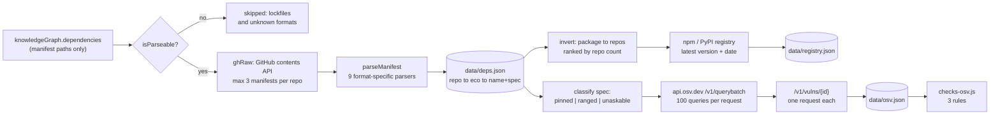

# 13. Supply chain: dependencies, advisories and secrets

**Status:** DERIVED - every count and ecosystem read from the files listed below.
**Sources:** `scripts/build-deps.js`, `scripts/lib-manifest.js`, `scripts/build-osv.js`, `scripts/checks-supply.js`, `scripts/checks-osv.js`, `scripts/checks-secrets.js`, `scripts/lib-hygiene.js`, `scripts/build-hygiene.js`, `data/deps.json`, `data/registry.json`, `data/osv.json`, `data/relations.json`, `data/hygiene.json`, `.github/workflows/update-forks.yml`

There is no `scripts/lib-deps.js` in this repository. Manifest parsing lives in `scripts/lib-manifest.js`, and that is the file read here.

Two questions are answered by this subsystem. What does a repository *depend* on, and is any of it known-vulnerable. And what has a repository *leaked* - credentials committed to source control. They share the audit machinery in `lib-hygiene.js` but nothing else.

## The pipeline

## Manifest discovery and extraction

Discovery is free: the knowledge graph already records which manifest paths exist in each tree, so `build-deps.js` never searches. It filters those paths through `isParseable`, fetches at most three per repository through the GitHub contents API, and hands each to the parser matched by filename.

| Ecosystem key | Manifest recognised | Extracted |
|---|---|---|
| `npm` | `package.json` | `dependencies`, `devDependencies`, `peerDependencies`; name plus declared range |
| `pypi` | `requirements*.txt` | name plus the trailing constraint; `-r`, `git+` and URL lines dropped |
| `pypi` | `pyproject.toml` | `[project] dependencies`, `[project.optional-dependencies]`, and poetry/pdm/hatch dependency tables; `python` itself excluded |
| `go` | `go.mod` | every `require` line, block or single, with its exact `v` version; case preserved |
| `cargo` | `Cargo.toml` | `[dependencies]`, `[dev-dependencies]`, `[build-dependencies]`, `[workspace.dependencies]`; both the plain string form and the inline-table `version =` form |
| `packagist` | `composer.json` | `require` and `require-dev`, minus `php` and `ext-*`/`lib-*` platform entries |
| `pub` | `pubspec.yaml` | `dependencies` and `dev_dependencies`, minus `flutter` |
| `rubygems` | `Gemfile` | `gem "name", "~> 1.2"`; the second string only when it contains a digit |
| (Gradle) | `build.gradle`, `build.gradle.kts` | artefact id and version from `implementation`/`api`/`compile` coordinates; case preserved |

Lockfiles are refused outright (`package-lock.json`, `yarn.lock`, `pnpm-lock`, `poetry.lock`, `Cargo.lock`, `composer.lock`, `Gemfile.lock`): they restate the same tree transitively and are often megabytes.

Two details matter downstream. Names are lower-cased for the registries that normalise anyway, but Go module paths and Maven artefacts keep their case, because `github.com/Masterminds/semver` and its lowercase form are different strings and an advisory lookup on the wrong one silently misses. And every parser returns the declared *spec* alongside the name, because a name alone cannot answer whether anything is stale.

Extraction results carry a `DEPS_VERSION` stamp, per repository rather than per file. Version 2 exists because the first parsers discarded versions for `go.mod`, `Gemfile`, `composer.json`, `pubspec.yaml`, `Cargo.toml` inline tables and Gradle; without the stamp those versionless rows would have been trusted forever.

## Coverage, honestly

`data/relations.json` puts the estate at **1,440 repositories**, of which **397 have declared dependencies** resolved, and 350 carry stack edges. `data/deps.json` holds entries for **1,171 repositories** - the difference is repositories recorded with an empty result, which is how an unparseable or unreadable tree avoids being retried every run.

Every figure below is therefore against a denominator of **397 repositories with resolvable manifests**, not against 1,440.

- **15,375 declared dependencies**, of which 14,250 (92.7%) carry some version spec.
- By ecosystem, repositories: npm 215, PyPI 187, cargo 41, Go 36, other 8, RubyGems 5, Packagist 3, pub 1.
- By ecosystem, declared packages: npm 7,444, PyPI 3,528, Go 2,632, cargo 1,509, other 96, Packagist 95, pub 38, RubyGems 33.
- `data/registry.json` holds **5,214 package entries** (3,534 npm, 1,680 PyPI), of which 4,952 resolved to a latest version and 262 did not - typically a private or renamed package.

Only npm and PyPI are resolved against a registry, and only the most-used packages first, because those cover the most repositories per request.

## Advisory matching

`build-osv.js` reduces each declared spec through `classify()` before asking anything. A spec that is `*`, `latest`, a URL, a `git+`, `file:`, `workspace:` or `link:` reference yields nothing to ask. Everything else yields a version and a confidence label:

- **pinned** - no operator, `==`, or `=`. What installs is known, so an advisory against it is a statement about this repository.
- **ranged** - a caret, tilde, `>=` floor, or any compound comma / double-pipe list. The floor is asked about, but the resolution is undetermined; npm resolves upward and usually lands on a patched release.

The same package can be pinned in one repository and ranged in another, so the query record tags each repository individually.

`data/osv.json` currently holds **12,177 cached dependency answers**, of which **1,388 are affected by at least one advisory**, and **3,841 advisories described** - 276 critical, 1,336 high, 1,352 medium, 314 low, 563 with no derivable severity, and 1 withdrawn (withdrawn advisories are filtered out of the rollup). Advisories carry CVSS vectors rather than a severity word, so `severityOf` derives one from `AV:N`/`PR:N`/`UI:N` and the count of high-impact fields, and keeps `unknown` as itself instead of guessing.

The per-repository rollup covers **320 repositories with at least one finding**: 146 with a pinned vulnerable version, 243 with a range that reaches one. Worst pinned severity: 56 critical, 60 high, 18 medium, 3 low, 9 unknown. Worst ranged: 127 critical, 100 high, 14 medium, 2 low. Finding records by ecosystem: PyPI 680, npm 554, Go 172, crates.io 167, Packagist 10, RubyGems 3.

### Why the budgets are shaped the way they are

`api.osv.dev` is unauthenticated and sits outside GitHub's REST limit, and `/v1/querybatch` accepts 100 queries per request. The whole estate therefore costs on the order of a hundred requests, not twelve thousand. The workflow allows `--budget 80`, meaning 80 batches, or up to 8,000 dependency questions per run.

Advisory *descriptions* are the exception. `/v1/vulns/{id}` is one request per advisory, unbatched, and it is the only part of the store that grows without bound as new advisories are published. It gets its own budget - `--details 150` in `update-forks.yml` - so a run cannot be dominated by detail fetches, and the backlog drains over successive runs like everything else. The identical shape appears in `build-deps.js`, invoked as `--budget 120` repositories and `--registry 150` packages per run.

## The checks

`checks-osv.js` does no work of its own; it reads this repository's entry from `data/osv.json` via `ctx.osv` and preserves the pinned/ranged distinction as three separately-ranked rules.

| Check id | Severity | Confidence | Fires when | Count in `data/hygiene.json` |
|---|---|---|---|---|
| `dependency-pinned-to-critical-vulnerability` | critical | 0.9 | a pinned version carries a critical advisory | 29 |
| `dependency-pinned-to-known-vulnerability` | high | 0.85 | a pinned version carries a high or medium advisory | 74 |
| `dependency-range-permits-vulnerability` | medium | 0.5 | a range reaches a critical or high advisory **and no lockfile exists** | 20 |

The lockfile condition on the third rule is the honest one: with a lockfile the resolution is recorded, so the claim "you cannot know what installs" is simply false, and the rule stays silent rather than guess. `ctx.osv` being absent means the lookup has not reached that repository - unknown, not clean.

`checks-supply.js` reasons about process rather than about specific advisories, and excludes vendored (`node_modules`, `vendor`, `.venv`, `site-packages`, `third_party`) and test-ish paths before firing:

| Check id | Severity | Count |
|---|---|---|
| `no-automated-dependency-updates` | medium | 936 |
| `dockerfile-base-image-unpinned` | medium | 491 |
| `manifest-without-lockfile` | high | 259 |
| `install-lifecycle-script` | medium | 59 |
| `dependency-directory-committed` | high | 12 |

`manifest-without-lockfile` walks up the directory tree before firing, because a monorepo lock lives at the root, and it exempts `requirements*.txt` since a fully pinned one is itself a lock. `install-lifecycle-script` stays quiet when every hook is the ordinary husky / tsc / build / patch-package case, and raises its evidence when a hook contains `curl`, `wget`, a URL, `node -e`, `eval`, `base64 -d` or `chmod +x`.

## Secrets, and the precision bar

Nearly all of this estate is other people's code, collected as forks. A secret finding published against a fork is a public claim about a stranger's repository, and publishing "leaked key" against a placeholder is worse than missing a real one. The catalogue is built around that asymmetry, in two tiers: path-only checks flag a file as worth opening, content checks confirm, and only a confirmed finding is published above low.

The gate is `looksReal()` in `lib-hygiene.js`. A candidate value is rejected if it is under 12 characters, matches a placeholder token (`your`, `xxx`, `changeme`, `example`, `todo` and the rest, each requiring a non-alphanumeric boundary), is a hyphenated word phrase of the `your-api-key-here` shape, contains a marker such as `placeholder` or `redacted` anywhere, contains angle or curly brackets, an ellipsis or a run of asterisks, is a single repeated character, is one of the known development passwords, or has Shannon entropy below 3.5 (3.2 for values under 20 characters).

The last filter is the strongest one available in an estate that is mostly forks: any value seen in three or more distinct repositories is treated as upstream sample data and suppressed, at the cost of one `Map`.

| Check id | Severity | What it matches | Count |
|---|---|---|---|
| `env-file-committed` | high | a tracked `.env`, excluding `.example`/`.sample`/`.template`/`.dist` and vendored paths | 97 |
| `no-secret-scanning-gate` | medium | a secret finding exists and no `.pre-commit-config`, `.gitleaks.toml`, `.secrets.baseline`, `.talismanrc`, `.githooks/` or security-named workflow | 86 |
| `gitignore-contradicts-tracked-secret` | high | a tracked file that the repository's own `.gitignore` patterns exclude | 35 |
| `env-secret-value-real` | critical | a `.env` key naming a credential, whose value passes `looksReal` | 23 |
| `database-dump-committed` | high | a `.sql`/`.dump`/`.sqlite` over 256KB that names itself a dump or exceeds 2MB, excluding migrations, schemas and course material | 10 |
| `private-key-committed` | critical | `id_rsa`-family or `.pem`/`.key`/`.pfx`/`.p12`/`.jks` whose body contains a `BEGIN ... PRIVATE KEY` header | 9 |
| `provider-token-committed` | critical | one of 15 machine-verifiable provider prefixes | 2 |
| `db-url-inline-password` | high | a database URL with an inline password that is neither a dev password nor a variable reference | 1 |
| `cloud-credential-file-committed` | critical | `.aws/credentials`, gcloud/azure/oci stores, `.kube/config`, `.databrickscfg`, over 200 bytes | 1 |
| `terraform-state-committed` | critical | a `.tfstate` outside test paths | 0 |
| `service-account-json-committed` | critical | JSON with a `service_account` type *and* an embedded `private_key` | 0 |
| `registry-auth-committed` | critical | `.npmrc`/`.pypirc`/`.yarnrc.yml` with a literal auth token rather than a variable reference | 0 |
| `shell-history-committed` | high | `.bash_history` and kin, `.netrc`, `.pgpass`, `.my.cnf`, over 200 bytes | 0 |

The `provider-token-committed` patterns are deliberately narrow - AWS, Google, Anthropic, NVIDIA, GitHub, GitLab, Slack tokens and webhooks, Stripe live keys, SendGrid, HuggingFace, Groq, npm, Supabase and Telegram prefixes - because a generic high-entropy sweep drowns in lockfile hashes and notebook output. Two further suppressors apply: a value appearing more than twice in the same file is documentation repeating a sample, and an `example`/`placeholder`/`dummy` word within 80 characters of the match disqualifies it. The check only sweeps files another check already fetched, so it costs no extra read budget.

The precision engineering is visible in the counts. `env-file-committed` fires 97 times; `env-secret-value-real`, which actually opens the file and tests the values, fires 23. Only 2 provider tokens survive every filter across the 1,439 audited repositories. Whether those remainders are true positives is not verifiable from these files - the checks record a match, not a confirmed live credential.

Two structural constraints keep this bounded. `ctx.read()` has a budget (20 files per repository in `build-hygiene.js`), and a check must treat a `null` read as *unknown*, never as clean - `private-key-committed` explicitly stays quiet on an unread `.pem`. And ranking multiplies severity by confidence by *reach*, where a fork with no CI scores 0.3 against an original repository's 1.0, so the same finding in someone else's collected code ranks below the same finding in code the owner deploys.

Finally, the symmetry: the repository performing this audit is itself public, and carries its own pre-commit secret scan in `.githooks/pre-commit`. It is subject to the rule it applies to everyone else. The hook's mechanics belong to the CI document.
